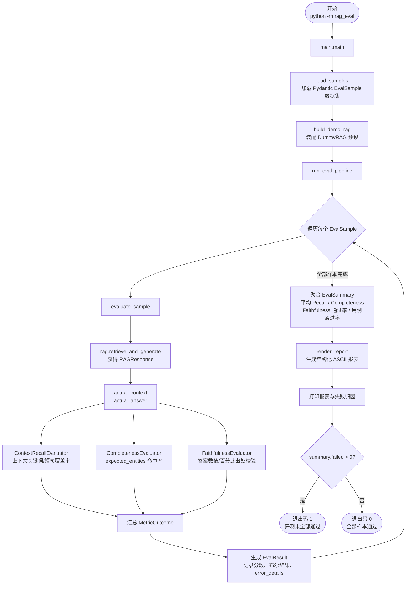
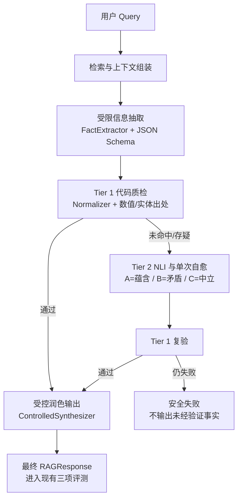
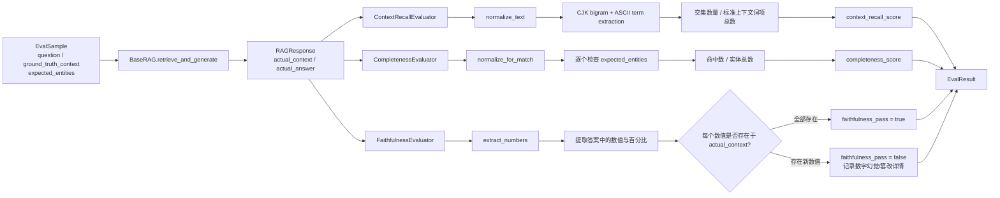
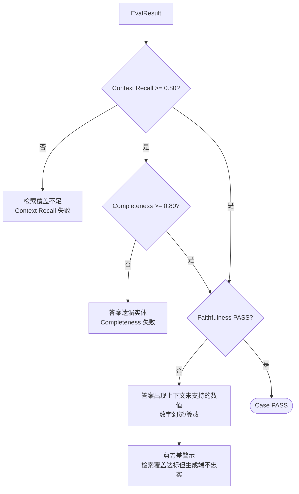
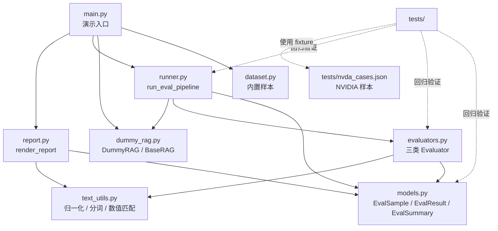
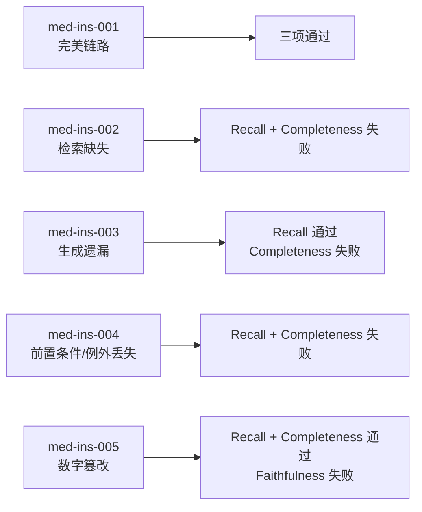
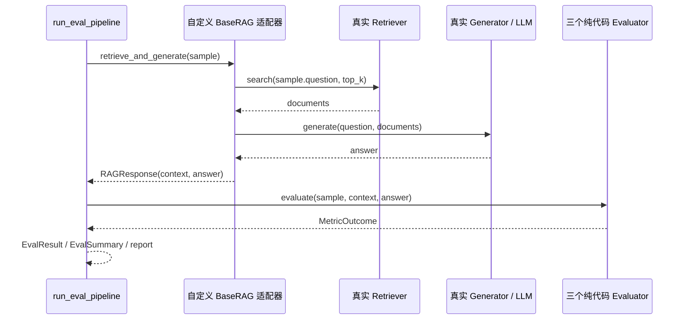

# Offline RAG Eval Harness 流程图

本文档描述当前项目从启动、数据加载、Dummy/真实 RAG 调用、三项评分，到聚合报表和退出码的完整流程。

## 1. 端到端执行流程

## 2. 五步受控生成流程

## 3. 单样本评分流程

## 3. 失败判定与指标剪刀差

## 4. 模块关系图

## 5. 当前演示数据的处理路径

## 6. 真实 RAG 接入点

真实系统只需要实现 `BaseRAG`：

