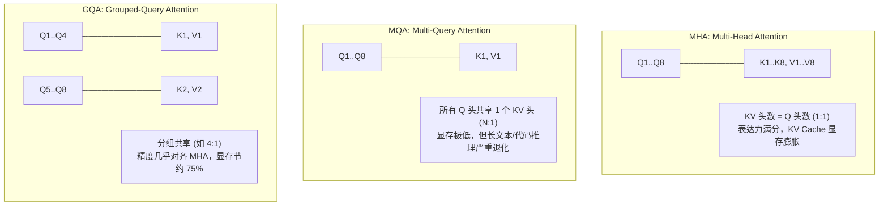
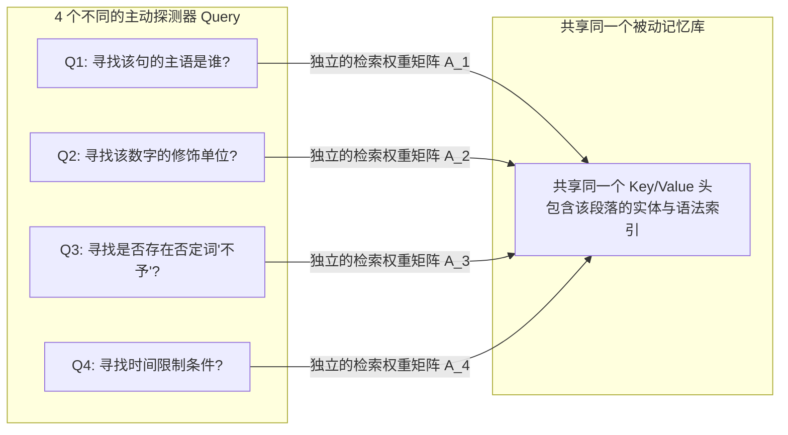

# GQA 核心机理全景面试级问答与底层深度复盘
### —— 从物理显存账本到“少头不傻”的数学与信息论本质

> **文档定位**：大模型架构与底层 Infra 面试级硬核收口指南  
> **核心命题**：“为什么 GQA 的 $H_{KV}$ 头数比 Q 头少？少存几个头模型为什么不会变傻？”  
> **关联机理**：MHA / MQA / GQA 演进史、Roofline 模型、Memory-Bound 解耦、FlashAttention 零拷贝广播、DeepSeek MLA 演进  
> **归档日期**：2026-09-23  

---

## 目录

- [一、高频面试真题与核心结论先导](#一高频面试真题与核心结论先导)
  - [1.1 面试官的核心命题与考查意图](#11-面试官的核心命题与考查意图)
  - [1.2 一分钟高分速答骨架（背诵级）](#12-一分钟高分速答骨架背诵级)
- [二、演进全景：从 MHA 到 MQA 再到 GQA](#二演进全景从-mha-到-mqa-再到-gqa)
  - [2.1 MHA（Multi-Head Attention）：表达力满分，显存灾难](#21-mhamulti-head-attention表达力满分显存灾难)
  - [2.2 MQA（Multi-Query Attention）：显存极致，能力退化](#22-mqamulti-query-attention显存极致能力退化)
  - [2.3 GQA（Grouped-Query Attention）：帕累托最优解](#23-gqagrouped-query-attention帕累托最优解)
- [三、灵魂拷问：少存几个 KV 头，模型为什么“不会变傻”？](#三灵魂拷问少存几个-kv-头模型为什么不会变傻)
  - [3.1 数学与信息论本质：Key 与 Value 的跨头特征冗余](#31-数学与信息论本质key-与-value-的跨头特征冗余)
  - [3.2 角色非对称性：Query 是主动探测器，Key/Value 是被动记忆库](#32-角色非对称性query-是主动探测器keyvalue-是被动记忆库)
  - [3.3 注意力权重的独立性证明：Softmax 依然多头多样化](#33-注意力权重的独立性证明softmax-依然多头多样化)
  - [3.4 经验经验验证：均值池化（Mean-Pooling）与 5% 微调恢复力](#34-经验经验验证均值池化mean-pooling与-5-微调恢复力)
- [四、硬核物理显存账本与 Roofline 吞吐推导](#四硬核物理显存账本与-roofline-吞吐推导)
  - [4.1 KV Cache 物理显存通用计算公式](#41-kv-cache-物理显存通用计算公式)
  - [4.2 案例实算：Qwen2.5-7B / LLaMA-3-8B 在 RTX 4080 (12GB) 上的账本对比](#42-案例实算qwen25-7b--llama-3-8b-在-rtx-4080-12gb-上的账本对比)
  - [4.3 为什么自回归 Decode 是 Memory-Bound？](#43-为什么自回归-decode-是-memory-bound)
  - [4.4 带宽搬运节约与并发 Batch 跃迁](#44-带宽搬运节约与并发-batch-跃迁)
- [五、底层计算实现：Query 头与 KV 头维度不对齐，GPU 算子到底怎么算？](#五底层计算实现query-头与-kv-头维度不对齐gpu-算子到底怎么算)
  - [5.1 朴素实现：`torch.repeat_interleave` 的显存陷阱](#51-朴素实现torchrepeat_interleave-的显存陷阱)
  - [5.2 工业级实现：FlashAttention 2 / vLLM 的零拷贝寄存器广播（Zero-Copy Broadcast）](#52-工业级实现flashattention-2--vllm-的零拷贝寄存器广播zero-copy-broadcast)
- [六、面试官高频连环追问（Q&A 模拟实战手册）](#六面试官高频连环追问qa-模拟实战手册)
  - [追问 1：既然 GQA 表现接近 MHA，为什么不直接全用 MQA？](#追问-1既然-gqa-表现接近-mha为什么不直接全用-mqa)
  - [追问 2：GQA 只能在预训练时确定吗？能否将已有的 MHA 模型直接改造成 GQA？](#追问-2gqa-只能在预训练时确定吗能否将已有的-mha-模型直接改造成-gqa)
  - [追问 3：DeepSeek 的 MLA（Multi-Head Latent Attention）相比 GQA 有何颠覆？](#追问-3deepseek-的-mlamulti-head-latent-attention相比-gqa-有何颠覆)
- [七、总结与知识卡片](#七总结与知识卡片)

---

## 一、高频面试真题与核心结论先导

### 1.1 面试官的核心命题与考查意图

在目前各大厂的大模型算法岗、LLM Infra/系统优化岗面试中，**GQA（Grouped-Query Attention）** 几乎是必考题。

面试官通常从浅入深分三层考察：
1. **基础认知**：了解 GQA 的头数比例（如 8:1 或 4:1）以及 MHA/MQA/GQA 的区别；
2. **系统工程层**：推导 KV Cache 显存占用，解释 Decode 阶段的 Memory-Bound 瓶颈；
3. **算法本质层（核心绝杀题）**：
   > **“GQA 把 KV 头的数量砍掉了 $\frac{3}{4}$（从 32 头砍到 8 头），少存了那么多数值，模型的表征能力为什么不会严重退化？模型为什么‘不会变傻’？”**

很多候选人能背出公式，但在第三层往往支支吾吾，归咎于“深度学习是玄学”。而能够从**特征冗余性、Query/Key 职能不对称性、Softmax 权重保留机制**清晰推导的候选人，往往能直接拿到评级上限。

---

### 1.2 一分钟高分速答骨架（背诵级）

> **考生标准回答范例**：  
> “模型之所以少存 KV 头却‘不会变傻’，核心在于三点：
> 1. **信息论与表征冗余**：SVD 奇异值分解等实证研究表明，MHA 各个头学到的 Key 和 Value 向量空间存在**高达 70% 以上的跨头高度共线性与基底重叠**。Key/Value 承载的是被动上下文实体的语法与事实特征，不需要 32 个独立的坐标系来描摹；
> 2. **职能的非对称性（主动探测器 vs 被动记忆库）**：Query 负责带着不同意图主动探测上下文（必须保持多头多样性，如 32 头）；而一组 Query（如 4 个 Q 头）完全可以**共享同一个紧凑的 KV 被动记忆库**；
> 3. **多头多样性并未丢失**：每个 Query 头依然拥有独立的 $W_Q$ 投影矩阵，计算出的注意力权重矩阵 $A_i = \text{Softmax}(Q_i K_g^T / \sqrt{d})$ 对每个 Query 而言**依然是完全独立、非线性的**！多头注意力最核心的多样性完全保留在 Query 和权重分布中，因此精度几乎无损，而 KV Cache 显存与总线搬运量却直接砍掉 75%。”

---

## 二、演进全景：从 MHA 到 MQA 再到 GQA

为了讲透 GQA，必须将三种架构置于同一坐标系下对比：



### 2.1 MHA（Multi-Head Attention）：表达力满分，显存灾难
* **结构**：$H_Q = H_K = H_V$。若有 32 个 Query 头，则有 32 个 Key 头和 32 个 Value 头。
* **痛点**：在自回归 Decode 阶段，每个 Token 都需要把全部 $H_{KV}$ 头常驻在显存中。长上下文下，KV Cache 显存甚至能超过模型权重本身，导致可承载的并发 Batch Size 极低。

### 2.2 MQA（Multi-Query Attention）：显存极致，能力退化
* **论文**：Shazeer (2019) *Fast Transformer Decoding: One Write-Head is All You Need*。
* **结构**：$H_Q = 32$，但 $H_K = H_V = 1$。所有 Query 头强行共享唯一一个 Key/Value 头。
* **缺陷**：过于激进。在代码生成、长文档 Needle-in-a-Haystack（大海捞针）多实体联合追踪任务中，精度大幅下降。

### 2.3 GQA（Grouped-Query Attention）：帕累托最优解
* **论文**：Ainslie et al. (2023) *GQA: Training Generalized Multi-Query Transformer Models from Multi-Head Checkpoints*。
* **结构**：将 $H_Q$ 个 Query 头均分为 $G$ 个组（Group），每组拥有 $H_Q / G$ 个 Q 头，同组内共享同一个 Key/Value 头。
* **工业事实标准**：
  - **LLaMA-2-70B / LLaMA-3-8B / 70B**：32 个 Q 头，8 个 KV 头（比例 4:1）；
  - **Qwen2.5-7B**：28 个 Q 头，4 个 KV 头（比例 7:1）；
  - **Qwen2.5-14B / 72B**：48/64 个 Q 头，8 个 KV 头（比例 6:1 或 8:1）。

---

## 三、灵魂拷问：少存几个 KV 头，模型为什么“不会变傻”？

这是本篇最核心的理论深水区。从三个不可替代的数学与认知视角彻底解答：

### 3.1 数学与信息论本质：Key 与 Value 的跨头特征冗余

在 Transformer 的预训练过程中，不同注意力头真的在学习完全不同的 Key 和 Value 吗？

科研界对训练好的 MHA 模型（如 LLaMA、GPT-3）权重进行了特征值分解（PCA / SVD）和跨头注意力表征相似度（CKA, Centered Kernel Alignment）分析，得出了惊人结论：
* **Query 向量空间的头间相似度极低**：不同 Query 头彼此正交，分别去探索时序先后、代词修饰、动宾搭配等完全不同的语义维度；
* **Key/Value 向量空间的头间相似度极高（高共线性）**：
  许多头的 Key 向量在投影后，其主成分特征（如“词性是否为名词”、“是否为标点句号”、“相对位置编码 RoPE 衰减”）高度趋同！

```text
[信息论直觉]：
在上下文中的某一个词（例如 "2026年"）：
- 作为一个被检索的事实（Key/Value）：它所具备的客观属性是相对固定的——它是一个时间实体、一个年份数字。
  你根本不需要用 32 种完全不同的线性空间去重复把 "2026年" 编码 32 遍！
- 提取 4~8 个高度代表性的基底（KV 头），就已经足够表达这个词在上下文中的全部语法与事实特征。
```

因此，砍掉多余的 KV 头，在信息论上本质就是**剥离了原本在 32 个头之间高度重叠的低秩冗余信息**，并没有破坏模型的有效秩（Effective Rank）。

---

### 3.2 角色非对称性：Query 是主动探测器，Key/Value 是被动记忆库

大模型中的注意力机制：
$$\text{Attention}(Q, K, V) = \text{Softmax}\left(\frac{Q K^T}{\sqrt{d_k}}\right) V$$

其本质是**信息检索（Information Retrieval）**系统：
* **Query 是“查询词 / 问卷”**：它是动态的、主动的、具有意图的；
* **Key 是“文档索引 / 标签”**：它是静态的、被动的；
* **Value 是“文档正文内容”**：它是被抽取的信息实体。



图书馆里有成千上万个读者（Query），每个读者进馆的目的千差万别（有的查历史，有的查借阅限额）；但这并不妨碍他们**去查阅同一套编目索引卡片（Key）和同一排书架（Value）**！

读者（Query）的多样性决定了阅读理解的广度；而书架索引（KV）只要足够规整准确，根本不需要给每一个读者都量身定制一套完全复刻的书架。

---

### 3.3 注意力权重的独立性证明：Softmax 依然多头多样化

很多工程师误以为：“既然 4 个 Query 头共享了同一个 KV 头，那这 4 个 Query 头算出来的注意力权重不就一模一样了吗？那多头不就退化成单头了吗？”

**大错特错！这是数学上的根本误解。**

设组内有 4 个 Query 头：$\mathbf{Q}_1, \mathbf{Q}_2, \mathbf{Q}_3, \mathbf{Q}_4 \in \mathbb{R}^{1 \times d_k}$，它们由各自独立的投影矩阵生成：
$$\mathbf{Q}_i = \mathbf{x} \mathbf{W}_Q^{(i)} \quad (i = 1, 2, 3, 4)$$

它们共享同一个 Key 向量 $\mathbf{K}_g \in \mathbb{R}^{L \times d_k}$。
现在分别计算 4 个头的注意力打分（Logits）：
$$\mathbf{S}_1 = \frac{\mathbf{Q}_1 \mathbf{K}_g^T}{\sqrt{d_k}}, \quad \mathbf{S}_2 = \frac{\mathbf{Q}_2 \mathbf{K}_g^T}{\sqrt{d_k}}, \quad \mathbf{S}_3 = \frac{\mathbf{Q}_3 \mathbf{K}_g^T}{\sqrt{d_k}}, \quad \mathbf{S}_4 = \frac{\mathbf{Q}_4 \mathbf{K}_g^T}{\sqrt{d_k}}$$

因为 $\mathbf{Q}_1 \neq \mathbf{Q}_2 \neq \mathbf{Q}_3 \neq \mathbf{Q}_4$（投影权重完全独立）：
$$\mathbf{S}_1 \neq \mathbf{S}_2 \neq \mathbf{S}_3 \neq \mathbf{S}_4 \implies \text{Softmax}(\mathbf{S}_1) \neq \text{Softmax}(\mathbf{S}_2) \neq \text{Softmax}(\mathbf{S}_3) \neq \text{Softmax}(\mathbf{S}_4)$$

$$\mathbf{A}_1 \neq \mathbf{A}_2 \neq \mathbf{A}_3 \neq \mathbf{A}_4$$

最后加权得到的注意力输出：
$$\mathbf{O}_i = \mathbf{A}_i \mathbf{V}_g \in \mathbb{R}^{1 \times d_v}$$

> **数学铁证**：  
> **虽然 $\mathbf{V}_g$ 是同一个矩阵，但加权矩阵 $\mathbf{A}_i$ 截然不同！**
> $\mathbf{Q}_1$ 可以让 $\mathbf{A}_1$ 聚焦在第 3 个 Token 上，抽取第 3 个 Token 的 Value；
> $\mathbf{Q}_2$ 可以让 $\mathbf{A}_2$ 聚焦在第 99 个 Token 上，抽取第 99 个 Token 的 Value。
> **每个头提取出的上下文语义表征向量 $\mathbf{O}_i$ 依然拥有完全独立的多样性！多头注意力的拟合能力完好无损！**

---

### 3.4 经验验证：均值池化（Mean-Pooling）与 5% 微调恢复力

GQA 论文（Ainslie et al., 2023）给出了极震撼的工程实验数据：
* 如果把一个已经用 MHA 预训练好的大型模型，将同组内的 4 个 KV 头参数进行**均值池化（Mean-Pooling）**折叠成 1 个 KV 头；
* 此时模型会产生轻微的精度扰动；
* 但**仅仅使用原始预训练 Token 量的 5% 进行轻量继续预训练（Uptraining）**，模型在各项学术榜单（MMLU、GSM8K、HumanEval）上的分数就**100% 恢复到了原始 MHA 的水平**！

这从实证科学的角度最终盖棺定论：**那 75% 的 KV 参数原本就是可以被无损压缩的冗余显存税！**

---

## 四、硬核物理显存账本与 Roofline 吞吐推导

### 4.1 KV Cache 物理显存通用计算公式

在长文本自回归生成中，单请求在显存中常驻的 KV Cache 尺寸由下式严格决定：

$$\text{KV Cache Size (Bytes)} = 2 \times n_{\text{layers}} \times H_{KV} \times d_{\text{head}} \times L_{\text{ctx}} \times \text{Precision (Bytes)}$$

* 因子 $2$：分别存储 Key 和 Value；
* $n_{\text{layers}}$：Transformer 的总层数；
* $H_{KV}$：**KV 头的数量**（MHA 下等于 $H_Q$，GQA 下通常等于 $H_Q / 4$ 或 $H_Q / 8$）；
* $d_{\text{head}}$：每个头的隐藏维度（通常为 128）；
* $L_{\text{ctx}}$：上下文 Token 长度；
* $\text{Precision}$：FP16/BF16 为 2 字节，FP8 为 1 字节。

---

### 4.2 案例实算：Qwen2.5-7B 在 RTX 4080 (12GB) 上的实测账本对比

结合我们在本次实战中所用的 **Qwen2.5-7B** 模型参数：
* $n_{\text{layers}} = 28$
* $H_Q = 28$
* $d_{\text{head}} = 128$
* 上下文锁定 $L_{\text{ctx}} = 4096$
* 精度为 FP16（2 字节）

#### 对比假设 1：如果 Qwen2.5-7B 采用传统 MHA ($H_{KV} = 28$)
$$\text{KV}_{\text{MHA}} = 2 \times 28 \times 28 \times 128 \times 4096 \times 2 \text{ Bytes} \approx \mathbf{1.64 \text{ GB (单请求)}}$$
* **4 并发并发占用**：$4 \times 1.64 \text{ GB} = \mathbf{6.56 \text{ GB}}$！
* 模型静态权重（4.7 GB）+ KV Cache（6.56 GB）+ CUDA 基础占用（1.0 GB）= **12.26 GB $\to$ 显存直接爆仓 OOM！** 在 12GB 显存显卡上连 4 并发都跑不起来！

#### 真实生产 2：Qwen2.5-7B 实际采用 GQA ($H_{KV} = 4$，比例 7:1)
$$\text{KV}_{\text{GQA}} = 2 \times 28 \times 4 \times 128 \times 4096 \times 2 \text{ Bytes} \approx \mathbf{0.234 \text{ GB (单请求)}}$$
* **4 并发并发占用**：$4 \times 0.234 \text{ GB} \approx \mathbf{0.936 \text{ GB}}$！
* 模型静态权重（4.7 GB）+ KV Cache（0.94 GB）+ 激活值与系统（0.9 GB）= **6.54 GB**！
* **实测显存余量高达 46.7%（5.7 GB 安全边际）！**

> **物理结论**：  
> **正是因为 GQA 将 KV Cache 直接砍掉了 $\frac{6}{7}$（85.7%），才使得在消费级 RTX 4080 (12GB) 显卡上能够游刃有余地跑满 4 个 4096 长度的长文本并发槽位！**

---

### 4.3 为什么自回归 Decode 是 Memory-Bound？

在模型推理中，有两个阶段：
1. **Prefill（首字编码阶段）**：一次性把整个长 Prompt 输入，可以进行矩阵乘矩阵（GEMM），算力强度（FLOPs/Byte）很高，属于 **Compute-Bound（计算受限）**；
2. **Decode（逐字吐字阶段）**：每一次生成，输入只有一个 Token（Sequence Length = 1）。计算退化为矩阵乘向量（GEMV）。

在 GEMV 中，计算量极小（$2 \times \text{Params}$），但每生成一个 Token，GPU 都必须把当前层**之前所有历史 Token 的 KV Cache 从显存总线完整加载进 SRAM 寄存器一次**！

根据 Roofline 模型：
$$\text{Attainable Performance} = \min\left(\text{Peak Compute}, \text{Memory Bandwidth} \times \text{Operational Intensity}\right)$$

在 Decode 阶段，GPU 的 Tensor Core 计算单元大部分时间在空转“饥饿等待”数据，瓶颈完全卡在**显存带宽（Memory Bandwidth）**。

### 4.4 带宽搬运节约与并发 Batch 跃迁

* **在 MHA 下**：每步 Decode 需要在显存总线搬运庞大的 KV 数据，总线瞬间被塞满；
* **在 GQA 下**：KV 数据传输量缩减为原来的 $\frac{1}{4} \sim \frac{1}{8}$。
* **物理收益**：
  1. 单请求 Decode 速度（Tokens/s）直接提升 **2 ~ 3 倍**；
  2. 显存带宽释放后，GPU 能够同时喂饱更大 Batch Size 的并发请求，系统综合 QPS 暴涨！

---

## 五、底层计算实现：Query 头与 KV 头维度不对齐，GPU 算子到底怎么算？

在编程实现中，一个非常现实的问题是：
* Query 张量维度：`[Batch, Seq_Q, 32, Head_Dim]`
* Key 张量维度：`[Batch, Seq_KV, 8, Head_Dim]`
32 与 8 无法直接做标准 Batch Matmul（批量矩阵乘法）。底层到底如何实现？

```mermaid
graph TD
    subgraph 做法 A: 朴素拷贝 (显存陷阱)
        K8A["Key [B, L, 8, D]"] --> Rep["torch.repeat_interleave(4)\n产生物理内存复制！"]
        Rep --> K32A["Key [B, L, 32, D]\nKV 显存膨胀回 MHA 水平！"]
    end

    subgraph 做法 B: 工业级内核融合 (FlashAttention 2)
        K8B["Key [B, L, 8, D] 保持压缩常驻显存"] --> SRAM["异步流式加载至 GPU 芯片内 SRAM 寄存器"]
        SRAM --> Broad["寄存器级零拷贝虚拟广播 (Zero-Copy Broadcast)\n完全不消耗额外全局显存！"]
    end
```

### 5.1 朴素实现：`torch.repeat_interleave` 的显存陷阱

初学者或一些教学代码往往这样写：
```python
# 将 8 个 KV 头强行复制 4 次，对齐成 32 头
key = torch.repeat_interleave(key, repeats=4, dim=2)
value = torch.repeat_interleave(value, repeats=4, dim=2)
# 然后做标准的 Q @ K.T
```
**这是灾难性的工程错误！**
`repeat_interleave` 会在 GPU 全局显存（HBM）中开辟新的物理内存并复制数据，**把 GQA 辛苦省下来的 75% 显存当场吐了回去**！

### 5.2 工业级实现：FlashAttention 2 / vLLM 的零拷贝寄存器广播

在生产级推理引擎（如 FlashAttention 2、vLLM、Ollama 的 llama.cpp）中：
1. **显存内保持压缩状态**：全局显存（HBM）中的 KV Cache 永远只存 8 个头，不做任何物理扩张；
2. **零拷贝虚拟索引（Strided Stride）**：在 CUDA 内核中，利用 PyTorch 的 `expand` 视图或直接在 C++/Triton 内核中修改指针步长（Stride），同一个 KV 头的内存地址被 4 个线程块（Thread Blocks）同时并发读取；
3. **SRAM 寄存器级广播**：数据加载进入 GPU 芯片内部极高速的片上 SRAM 缓存后，在寄存器层面广播给 4 个 Query 计算单元使用。**全程零全局显存开销，零额外带宽占用！**

---

## 六、面试官高频连环追问（Q&A 模拟实战手册）

### 追问 1：既然 GQA 表现接近 MHA，为什么不直接全用 MQA？

* **答题要点**：
  1. **极值任务精度断崖**：MQA（所有头共用 1 个 KV）在通用对话上表现尚可，但在**长文本精确位置索引（Needle in a Haystack）**、**长程代码变量依赖分析**和**复杂数学推演**上，精度出现严重断崖式下跌；
  2. **注意力分散陷阱**：单 KV 头意味着整个序列只有一个注意力特征分布，当面对 128k 长上下文时，单个 Key 头根本无法同时编码“文档前言”、“财务表格第 5 行”、“末尾责任条款”等多元异构特征，注意力被无限平滑摊薄；
  3. **GQA 是帕累托最优平衡**：实验表明，从 MHA 到 GQA（如 8 头），精度损失几乎为 0；但从 GQA 到 MQA，精度损失非线性剧增。GQA 已经拿下了 75%~85% 的显存收益，没有必要为了剩下 15% 的边际收益去冒模型变傻的巨大风险。

---

### 追问 2：GQA 只能在预训练时确定吗？能否将已有的 MHA 模型直接改造成 GQA？

* **答题要点**：
  1. **完全可以后天改造（Uptraining）**；
  2. **核心初始化技术——均值池化（Mean-Pooling Initialization）**：
     将原 MHA 中属于同一组的 4 个头的权重矩阵相加求平均：
     $$W_K^{\text{GQA}} = \frac{1}{4} \sum_{i=1}^{4} W_K^{(i)}, \quad W_V^{\text{GQA}} = \frac{1}{4} \sum_{i=1}^{4} W_V^{(i)}$$
  3. **微调成本极低**：只需使用该模型原本预训练语料的约 5% Token 进行继续预训练（Uptraining），模型即可自适应对齐，精度完全恢复，无需从头消耗数百万 GPU 时。

---

### 追问 3：DeepSeek 的 MLA（Multi-Head Latent Attention）相比 GQA 有何颠覆？

* **答题要点**：
  1. **GQA 的局限**：GQA 是在**注意力头维度（Head Dimension）**做离散砍伐（从 32 头粗暴砍到 8 头）；
  2. **MLA 的降维升维创新**：DeepSeek-V2 / V3 提出了低秩潜变量压缩（Low-Rank Latent Projection）。它不在头数上做阉割（依然保持 128 个注意力头！），而是把 Key 和 Value 联合投影压缩到一个极低维度的隐空间向量 $c_t^{KV}$（例如仅 512 维）；
  3. **显存存储效果**：每个 Token 的 KV Cache 只需存储这个 512 维的潜变量，显存开销**比 GQA 还要小 5~8 倍**；
  4. **矩阵吸收技巧（Matrix Absorption）**：在生成计算时，利用矩阵结合律 $(Q W^{UK}) c_t^{KV}$，直接将解码矩阵合并进 Query 投影中，根本不需要在内存中显式解压出完整的 Key/Value！

---

## 七、总结与知识卡片

| 核心维度 | 关键机理收口 |
| :--- | :--- |
| **核心命题** | GQA 为什么少存头不傻？ |
| **本质归因 1** | **特征冗余论**：Key/Value 向量空间存在 70%+ 的跨头共线性基底重叠。 |
| **本质归因 2** | **职能非对称论**：Query 是主动探索者（需多样性），KV 是被动记忆库（可共享）。 |
| **本质归因 3** | **权重独立性**：虽然共享 KV，但每个 Query 算出的 Softmax 权重矩阵依然各不相同。 |
| **物理收益** | KV Cache 显存缩减 **75%~87.5%**，解除自回归 Decode 的 **Memory-Bound** 瓶颈。 |
| **算子实现** | 显存保持压缩态，依赖 FlashAttention 在片上 SRAM 执行**零拷贝虚拟寄存器广播**。 |
| **下一代演进** | DeepSeek MLA（低秩潜变量投影 + 矩阵吸收），在保留全头表达力的同时进一步压缩显存。 |

---
*(全文完，本篇为面试核心必杀考点，建议反复背诵与自我演练)*
