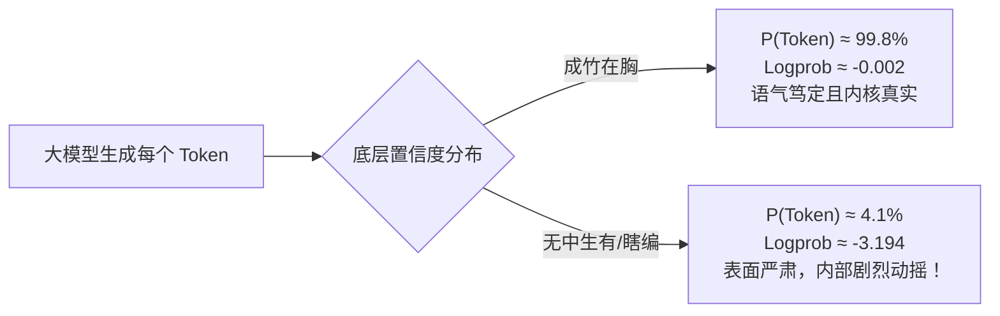
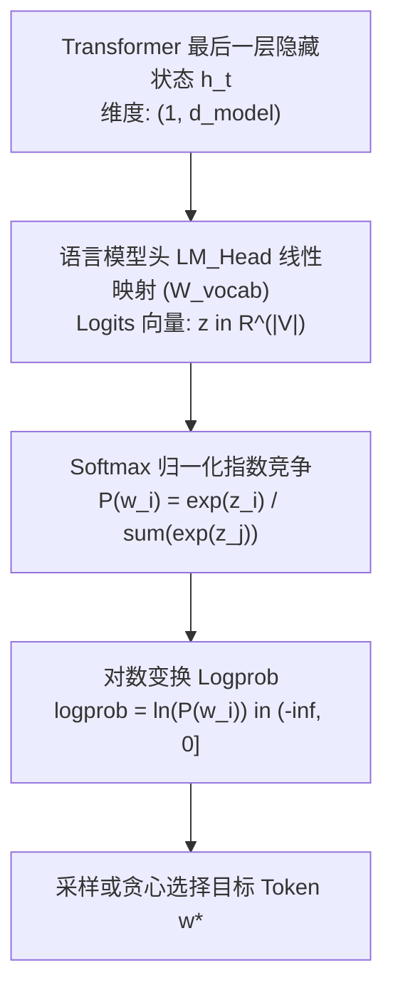
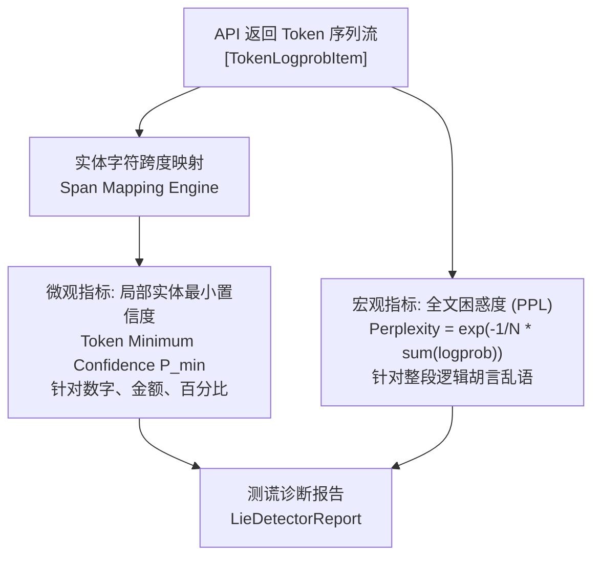
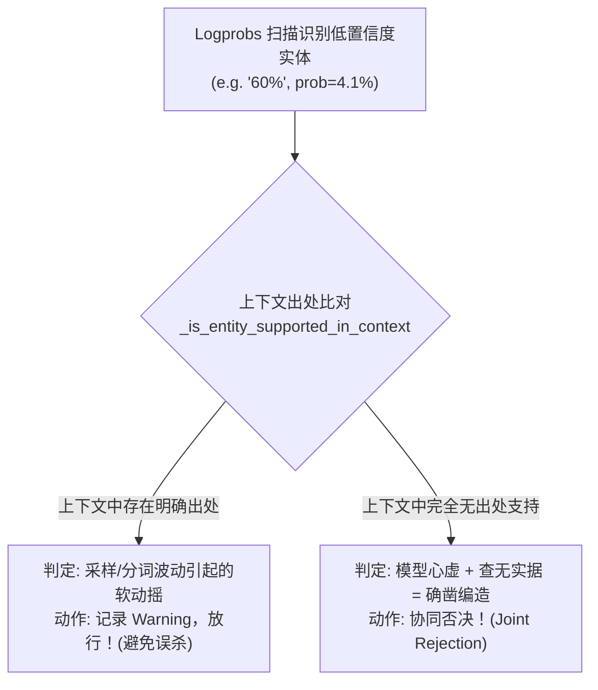

# Logprobs 零成本测谎仪——从分母抹杀理论到软预警协同裁决

> **摘要**：在金融报表、医疗医保、政务合规等对数字极度敏感的严肃 RAG 场景中，大模型常常以极其笃定自信的语气，吐出完全捏造的虚假事实或被篡改的金额数字。传统的 Prompt 约束与端到端质检因无法穿透模型生成黑盒，往往陷入“事后盲猜”的被动局面。本文基于开源系统 **Aegis-RAG** 的底层工业实践（`rag_eval/verifiers/logprobs_analyzer.py`），深入剖析大模型生成过程中底层的原始对数概率（Logprobs）、Softmax 归一化竞争机理、局部实体置信度与动态困惑度（PPL）。尤为关键的是，本文系统性揭示了当前火热的基于状态机 Logit Masking 强制约束在物理层面造成的**“分母抹杀致盲陷阱”**，并提出**“测谎仪剥离一票否决权 + 上下文协同裁决 + 生产/评测双链路物理隔离”**的工业级解决方案。

---

## 目录

- [一、生活比喻：大模型的“测谎仪”与“心虚脉搏”](#一生活比喻大模型的测谎仪与心虚脉搏)
  - [1.1 笃定的骗子与流汗的微表情](#11-笃定的骗子与流汗的微表情)
  - [1.2 为什么黑盒文本测不出“心虚”？](#12-为什么黑盒文本测不出心虚)
- [二、数学底层：从 Logit 到 Logprob 的概率链条](#二数学底层从-logit-到-logprob-的概率链条)
  - [2.1 生成式自回归的物理本质](#21-生成式自回归的物理本质)
  - [2.2 Softmax 概率归一化公式](#22-softmax-概率归一化公式)
  - [2.3 为什么取自然对数（Logprob）？](#23-为什么取自然对数logprob)
- [三、核心算法：数字心虚度探针的双轮驱动](#三核心算法数字心虚度探针的双轮驱动)
  - [3.1 指标一：局部实体最小置信度（Token Minimum Confidence）](#31-指标一局部实体最小置信度token-minimum-confidence)
  - [3.2 实体对齐跨度映射（Span Mapping）算法](#32-实体对齐跨度映射span-mapping算法)
  - [3.3 指标二：全文困惑度（Perplexity, PPL）与滑动窗口](#33-指标二全文困惑度perplexity-ppl与滑动窗口)
- [四、惊天机制碰撞：Logit Masking 的“分母抹杀致盲陷阱”](#四惊天机制碰撞logit-masking-的分母抹杀致盲陷阱)
  - [4.1 什么是 Logit Masking？工业界为何对它趋之若鹜？](#41-什么是-logit-masking工业界为何对它趋之若鹜)
  - [4.2 数学推导：分母抹杀（Denominator Eradication）](#42-数学推导分母抹杀denominator-eradication)
  - [4.3 虚假繁荣：100% 置信度的致命幻觉](#43-虚假繁荣100-置信度的致命幻觉)
- [五、破局设计：为什么 Logprobs 绝不能拥有一票否决权？](#五破局设计为什么-logprobs-绝不能拥有一票否决权)
  - [5.1 分词碎片化（BPE Fluctuation）导致的冤假错案](#51-分词碎片化bpe-fluctuation导致的冤假错案)
  - [5.2 软预警与协同裁决（Joint Verification）机制](#52-软预警与协同裁决joint-verification机制)
  - [5.3 协同判决真值表（Truth Matrix）](#53-协同判决真值表truth-matrix)
- [六、工业落地方案：双链路物理隔离架构](#六工业落地方案双链路物理隔离架构)
  - [6.1 链路 A：线上生产实时主链路（确定性护航）](#61-链路-a线上生产实时主链路确定性护航)
  - [6.2 链路 B：线下/异步可观测性沙盒链路（测谎探针）](#62-链路-b线下异步可观测性沙盒链路测谎探针)
- [七、代码实战：`logprobs_analyzer.py` 源码走读与执行实测](#七代码实战logprobs_analyzerpy-源码走读与执行实测)
  - [7.1 核心数据结构与契约定义](#71-核心数据结构与契约定义)
  - [7.2 敏感实体扫描与跨度回溯](#72-敏感实体扫描与跨度回溯)
  - [7.3 协同裁决逻辑实现](#73-协同裁决逻辑实现)
- [八、总结与心法：给大模型套上透明听诊器](#八总结与心法给大模型套上透明听诊器)

---

## 一、生活比喻：大模型的“测谎仪”与“心虚脉搏”

### 1.1 笃定的骗子与流汗的微表情

在刑事侦查中，经验丰富的审讯专家常常面对两类嫌疑人：
* 第一类人做贼心虚，说话支支吾吾，眼神闪烁；
* 第二类人则是受过反侦察训练的高智商罪犯，即便在编造弥天大谎，表面上也能做到**神态自若、谈吐流利、语气笃定**。

大语言模型（LLM）恰恰就是最顶级的“第二类说谎者”。

当你向它提问：“某医保目录中三级医院普通门诊报销比例是多少？”，如果检索召回的上下文中只提到了“二级医院 75%”，根本没有出现三级医院的比例，模型极有可能直接输出：
> *“三级医疗机构的报销比例为 60%，政策规定明确，请放心报销。”*

从排版、语法到文采，它挑不出任何毛病，语气极其严肃权威。如果仅从模型输出的自然语言字符串去判断，任何后置检查器都会被它这副“义正辞严”的外表欺骗。

**但是，大模型无法隐藏它在吐字那一瞬间的生理脉搏与微表情——这就是对数概率（Logprobs）。**



### 1.2 为什么黑盒文本测不出“心虚”？

在传统 RAG 流水线中，客户端通过 HTTP 接口调取大模型时，默认只拿到了 `{"text": "60%"}`。这就像隔着一堵水泥墙听犯人交代案情，你只能听见声音，看不到犯人正在满头大汗、心率飙升至 160。

在自回归解码的每一步，模型实际上是在整个几万词的 Vocabulary（词表）上计算了所有可能 Token 的概率分布。当模型真正“知道”答案时，注意力机制强烈聚集在特定事实 Token 上，该 Token 的预测概率会高达 90% 以上；而当模型开始“脑补”虚构数据时，候选词的概率往往呈断崖式离散分布，最终被采样的那个 Token，原生概率可能只有可怜的 3% ~ 5%。

**Logprobs，就是穿透这堵黑盒水泥墙的无损“数字听诊器”。**

---

## 二、数学底层：从 Logit 到 Logprob 的概率链条

要真正理解测谎仪的运行机制，必须彻底拆解模型生成每一个 Token 的数学链条。



### 2.1 生成式自回归的物理本质

在时间步 $t$，大模型根据已生成的序列 $w_{<t}$ 经过深度注意力网络计算，输出最后一个隐藏状态向量 $\mathbf{h}_t \in \mathbb{R}^{d_{\text{model}}}$。随后通过未归一化的全连接输出层（LM Head），投影到整个词表大小 $|\mathcal{V}|$ 的向量空间中，得到未归一化的原始打分，即 **Logits**：

$$\mathbf{z}_t = \mathbf{h}_t \mathbf{W}_{\text{vocab}}^T \in \mathbb{R}^{|\mathcal{V}|}$$

其中 $|\mathcal{V}|$ 在主流大模型中通常为 32,000 到 150,000（如 Qwen2.5 的词表为 151,646）。

### 2.2 Softmax 概率归一化公式

为了将无界的实数打分 $z_i \in (-\infty, +\infty)$ 转化为合法的概率分布，模型在词表维度应用标准 Softmax 函数：

$$P(w_i) = \frac{\exp(z_i)}{\sum_{j=1}^{|\mathcal{V}|} \exp(z_j)}$$

在这个公式中，**分母 $\sum_{j} \exp(z_j)$ 代表了全词表所有候选 Token 的能量总和**。每一个 Token 都在分母中与其他候选者展开激烈的“注意力竞争”。

### 2.3 为什么取自然对数（Logprob）？

在工程计算和统计推断中，直接传递和存储 $P(w_i) \in (0, 1]$ 存在严重缺陷：
1. **数值下溢（Underflow）**：一个由 100 个 Token 组成的句子，其联合生成概率是各个 Token 条件概率的连乘积：
   $$\prod_{t=1}^{100} P(w_t | w_{<t})$$
   计算机的双精度浮点数会在连乘十几个极小概率后直接归零（Underflow）。
2. **计算加和性（Additivity）**：通过自然对数变换，将乘法变为加法：
   $$\text{logprob}(w_i) = \ln P(w_i)$$
   联合对数似然直接等于各步对数概率之和：
   $$\ln \mathcal{L} = \sum_{t=1}^{N} \text{logprob}(w_t)$$

#### Logprob 数值对照度量表：

| 生成置信度等级 | 真实概率 $P$ | 对数概率 Logprob | 模型内部心理写照 | 风险判定 |
| :--- | :---: | :---: | :--- | :--- |
| **绝对确信** | $99.9\%$ | **$-0.0010$** | 检索原文白纸黑字写着，笃定无误 | 极低风险 |
| **高度稳定** | $85.0\%$ | **$-0.1625$** | 上下文强关联，推理顺畅 | 低风险 |
| **中度动摇** | $50.0\%$ | **$-0.6931$** | 存在两三个近义候选，尚可接受 | 需关注 |
| **严重心虚** | $20.0\%$ | **$-1.6094$** | 缺乏充分上下文支持，概率严重分流 | ⚠️ 高风险 |
| **胡编乱造** | $5.0\%$ | **$-2.9957$** | 上下文完全未提及，强行拼凑数字 | 🚨 致命幻觉 |
| **离谱虚构** | $1.0\%$ | **$-4.6052$** | 模型在几万个词里盲目撞大运 | 🚨 致命幻觉 |

---

## 三、核心算法：数字心虚度探针的双轮驱动

在 Aegis-RAG 的 `logprobs_analyzer.py` 中，我们构建了**微观局部探针**与**宏观全局探针**协同工作的双轮驱动体系。



### 3.1 指标一：局部实体最小置信度（Token Minimum Confidence）

在金融与医疗业务中，文字的语法修饰可以灵活，但**数字、金额、百分比、机构名称**一个标点都不能错。

传统的文本困惑度往往计算整个句子的平均概率，但这存在致命盲区：
> 句子中大量的助词、介词和常见动词（如“根据”、“规定”、“由”、“予以”）具有极高概率（$P > 95\%$），其平均值会轻松拉高整体均分，从而**掩盖掉关键数字仅有 3% 置信度的严重险情**！

因此，Aegis-RAG 引入**局部实体最小置信度**算法：
针对抽取出的关键实体 $E$，由若干个 Token 碎片 $[w_{e1}, w_{e2}, \dots, w_{em}]$ 组成。该实体的真实置信度取决于**这组 Token 中最脆弱、最心虚的那个木桶短板**：

$$\text{Confidence}(E) = \min_{w \in E} P(w)$$

只要实体内任何一个 Token 的概率低于设定阈值（生产环境通常设为 $0.40 \sim 0.50$），立刻将该实体点亮为疑似幻觉！

### 3.2 实体对齐跨度映射（Span Mapping）算法

大模型的分词器（Tokenizer）通常会将一个数字拆分为多个 Subword Token。例如：
* 文本字符串：`"1500元"`
* 分词结果：`["15", "00", "元"]`
* 对应的概率：`[0.92, 0.04, 0.98]`

如果单独看 `"15"` 或 `"元"`，模型都胸有成竹；但中间拼接 `"00"` 时，模型内心发生剧烈动摇（仅 4% 概率，它其实不知道后面是 00 还是 000）。

`logprobs_analyzer.py` 内部实现了字符级滑动映射：
```python
# 构建字符索引 → token 索引映射，精确定位哪个 token 属于哪个实体
current_char_pos = 0
token_spans: list[tuple[int, int, TokenLogprobItem]] = []
for item in tokens_logprobs:
    start = current_char_pos
    end = start + len(item.token)
    token_spans.append((start, end, item))
    current_char_pos = end

# 逐个对齐检查目标实体内部的所有 Token
for m in combined_regex.finditer(full_text):
    m_start, m_end = m.span()
    overlapping_tokens = [
        item for (t_s, t_e, item) in token_spans
        if max(m_start, t_s) < min(m_end, t_e)
    ]
    # 提取实体内部最心虚的短板
    min_token = min(overlapping_tokens, key=lambda t: t.prob)
```

通过这一算法，系统精准锁定了 `1500元` 内部潜藏的致命风险，捕获了具体的短板 Token `"00"` 及其原始概率值。

### 3.3 指标二：全文困惑度（Perplexity, PPL）与滑动窗口

如果局部探针负责抓“局部数字作伪”，那么**困惑度（Perplexity, PPL）**则负责抓“通篇语无伦次”。

困惑度是语言模型评估文本自然度与内在惊异程度的黄金标准。其数学定义为交叉熵的指数：

$$\text{PPL} = \exp\left( -\frac{1}{N} \sum_{t=1}^{N} \ln P(w_t | w_{<t}) \right) = \exp\left( -\frac{1}{N} \sum_{t=1}^{N} \text{logprob}_t \right)$$

* **物理含义**：PPL 可以直观理解为“模型在预测下一个词时，平均在多少个等可能性的候选词之间摇摆不定”。
* **数值经验法则**：
  - $\text{PPL} \in [1.0, 3.0]$：行文极其流畅，模型对上下文理解非常透彻，逻辑高度收敛；
  - $\text{PPL} \in [3.0, 8.0]$：正常业务回复区间；
  - $\text{PPL} > 8.0$：模型开始在拼凑虚假逻辑或生搬硬套不相关的知识；
  - $\text{PPL} > 20.0$：通篇严重语病、复读机现象或严重幻觉发散。

在长文本问答场景中，系统还支持在滑动窗口（Sliding Window，如 64 个 Token）内计算局部 PPL 曲线，一旦曲线在某一段落出现断崖式向上尖刺，即可精确定位整段胡说八道的起始段落。

---

## 四、惊天机制碰撞：Logit Masking 的“分母抹杀致盲陷阱”

现在，我们将揭示整个大模型系统工程中最具戏剧性、也最容易坑惨资深工程师的机制碰撞——**当结构化前验硬约束（Logit Masking）遇到底层概率测谎仪（Logprobs）**。

### 4.1 什么是 Logit Masking？工业界为何对它趋之若鹜？

在推进大模型工程化时，所有研发团队都会遇到一个噩梦：**大模型不听话，输出的 JSON 偶尔缺少引号、键名拼错或冒充散文**。

为了彻底解决格式合规，以 **Outlines、Guidance、vLLM、SGLang** 为代表的前沿框架推出了基于有限状态机（FSM）的 **Logit Masking（约束解码）**：
* 预先定义好 JSON Schema；
* 启动一个轻量级的词法 FSM 状态机追踪模型生成的每一个字符；
* 当模型在某一步只能输出数字时，FSM 将词表中所有**非数字 Token**的 Logit 全部硬编码修改为 $-\infty$：
  $$z_{\text{illegal}} = -\infty$$
* 这样，采样器在挑选下一个 Token 时，数学上**绝对不可能**选到非法字符，保证了 100% 格式合法。

这听起来简直是工业级生产的“银弹”，对不对？**灾难正是在这里爆发的！**

---

### 4.2 数学推导：分母抹杀（Denominator Eradication）

让我们通过严谨的数学推导，重现这个致命的“致盲事故”。

设当前词表大小 $|\mathcal{V}| = 10,000$。模型刚刚输出了键名 `"ratio": `，下一步必须输出一个数值。
此时，模型的真实语义注意力正在剧烈摇摆，它根本不知道比例是多少。

#### 1. 未开启 Masking 时的真实世界（原生 Softmax）：
模型内部的原始未修饰 Logit 为：
* 数字 Token `"6"`：$z_{\text{"6"}} = 2.0$（模型觉得可能是 6）；
* 散文 Token `"具体"`：$z_{\text{"具体"}} = 8.0$（模型其实极度想输出“具体规定未知”，这个意图极其强烈！）；
* 散文 Token `"根据"`：$z_{\text{"根据"}} = 7.5$。

计算真实的 Softmax 概率：
$$P(\text{"6"}) = \frac{\exp(2.0)}{\exp(2.0) + \exp(8.0) + \exp(7.5) + \sum_{\text{others}} \exp(z_j)} \approx \frac{7.39}{7.39 + 2980.96 + 1808.04 + \dots} \approx \mathbf{0.0015} \ (0.15\%)$$

此时，$\text{logprob}(\text{"6"}) = \ln(0.0015) = \mathbf{-6.50}$。
**测谎仪瞬间报警！** 报告显示：该数字置信度仅为 $0.15\%$，判定为极高风险的恶意编造！

#### 2. 开启 Logit Masking 后的虚假幻境（分母抹杀）：
FSM 状态机检测到当前只能填数字，于是悍然出手，将所有非数字 Token 的 Logit 强设为 $-\infty$：
* $z_{\text{"具体"}} \leftarrow -\infty$
* $z_{\text{"根据"}} \leftarrow -\infty$
* 假设在当前状态机的语法规则下，数字候选只允许为特定格式，甚至只匹配到了单字符 `"6"`。

现在，再次执行 Softmax 计算：
$$P(\text{"6"}) = \frac{\exp(2.0)}{\exp(2.0) + \exp(-\infty) + \exp(-\infty) + \dots} = \frac{\exp(2.0)}{\exp(2.0) + 0 + 0 + \dots} = \frac{\exp(2.0)}{\exp(2.0)} = \mathbf{1.0000} \ (\mathbf{100\%})$$

再求对数概率：
$$\text{logprob}(\text{"6"}) = \ln(1.0000) = \mathbf{0.0000}$$

---

### 4.3 虚假繁荣：100% 置信度的致命幻觉

看到了吗？这就是著名的**分母抹杀现象（Denominator Eradication）**！

```text
[无 Masking 原生状态]   Softmax 分母充分竞争 -> P("6") = 0.15%  (测谎仪: 发现心虚！报警！)
        │
        ▼ 开启 Logit Masking
[分母抹杀人为干预]   竞争项全部置为 -inf -> P("6") = 100.0% (测谎仪: 极度确信！放行！)
```

> **致命结论**：  
> **Logit Masking 人为抹杀了 Softmax 分母中的全部竞争者，使得哪怕模型对某个数字只有 0.01% 的把握，计算出来的最终 Logprob 也会被硬生生拉到 0.0（对应 100% 概率）。底层概率测谎仪在 Logit Masking 面前被彻底“人工致盲”！**

如果你在开启了 Logit Masking 强制约束 JSON 的流水线上挂载 Logprobs 测谎仪，你采集到的所有数据都将是一片祥和的 100% 置信度，而实际上模型可能正在肆无忌惮地胡编数字！

---

## 五、破局设计：为什么 Logprobs 绝不能拥有一票否决权？

既然 Logprobs 有可能被致盲，而且在自由生成时也会受到其他干扰，那么在工业级架构中，它究竟应该扮演什么角色？

### 5.1 分词碎片化（BPE Fluctuation）导致的冤假错案

除了分母抹杀，单纯依赖 Logprobs 执行“一票否决”在工程上还会带来严重的**误杀率（False Rejection）**：
1. **分词边界偶发抖动**：如果模型在输出数字前多加了一个空格或者全角字符，Tokenizer 会将数字切分成罕见的前缀碎片，导致该 Token 的概率骤降至 30%，但上下文原文完全支持这一事实；
2. **近义同义词分流**：在回答“医疗机构”时，“医院”、“机构”、“医疗单位”三个词在语义上完全一致，各自瓜分了 30% 的概率，导致每个词单独看都处于“心虚”状态，但事实毫无差错。

**因此，Aegis-RAG 确立了一条不可动摇的底线架构原则：**
> **Logprobs 测谎仪反映的是模型内在的概率分布特征，属于软性启发式预警，绝对不能作为生产环境单独一票否决的硬断言！**

---

### 5.2 软预警与协同裁决（Joint Verification）机制

在 `logprobs_analyzer.py` 的工业级重构中，我们设计了**软预警协同裁决（Joint Verification）**机制：



测谎仪不再单打独斗，而是与上下文检索库形成**双向校验锁**：
1. **默认禁用单独立即否决**：`allow_sole_veto = False`，测谎仪只出具 `warnings` 和 `has_risk = True` 标记；
2. **双重确凿才触发硬否决**：只有当一个实体**既被测谎仪标记为低置信度（内心心虚），又在检索上下文原文中查不到任何出处支持（查无证据）**时，系统才正式下达拒赔或拦截指令。

### 5.3 协同判决真值表（Truth Matrix）

| 场景编号 | 模型生成内容 | Logprob 置信度 | 上下文出处验证 | 测谎仪标记 | Tier-1 确定性网关 | 最终系统裁决 | 状态解析 |
| :---: | :---: | :---: | :---: | :---: | :---: | :---: | :--- |
| **Case 1** | `"报销 85%"` | **高 ($98\%$)** | **有出处** | 正常绿色 | 验证通过 | **放行 (Pass)** | 理想状态，事实确凿且自信 |
| **Case 2** | `"起付 300元"`| **低 ($35\%$)** | **有出处** | ⚠️ 软预警 | 验证通过 | **放行 (Pass)** | **成功避免误杀！** 虽分词动摇但原文白纸黑字 |
| **Case 3** | `"限额 20万"` | **低 ($4\%$)** | **无出处** | 🚨 致命心虚 | 验证不通过 | **协同击毙 (Veto)** | **双重锁定！** 既编造又心虚，直接熔断 |
| **Case 4** | `"全免 100%"` | **高 ($99\%$)** | **无出处** | 正常绿色 | **一票否决** | **确定性击毙 (Veto)**| **Tier-1 兜底！** 模型笃定地胡说，被代码硬规则拦死 |

看！通过 Case 2 与 Case 4 的互补，我们完美解耦了大模型的不确定性：
* **Case 2 保护了吞吐率**：不让无辜的正确答案因为 Token 切分抖动而被抛弃；
* **Case 4 守住了安全红线**：哪怕大模型被分母抹杀或者自我洗脑到了 100% 虚假自信，只要上下文没有，**Tier-1 纯代码规则网关依旧拥有最高一票否决权**！

---

## 六、工业落地方案：双链路物理隔离架构

为了彻底解决 Logit Masking 结构化输出与 Logprobs 测谎仪的底层冲突，Aegis-RAG 在企业级落地中推行了经典的**双链路物理隔离架构（Dual-Track Architecture）**：

```mermaid
graph TD
    subgraph 链路 A: 线上实时生产主链路 (极速/合规)
        ReqA[用户实时查询] --> ExtA["受限抽取 (FSM Masking 强制 JSON)"]
        ExtA --> OptA["关闭 logprobs=True (省带宽/降延迟)"]
        OptA --> GateA["Tier-1 纯代码确定性 Verifier\n(出处正则 / 量纲核验)"]
        GateA -->|一票否决| BlockA[安全熔断拒答]
        GateA -->|100% 验收| RealizerA["EntityAwareRealizer 纯代码表面拼装"]
        RealizerA --> OutA[交付最终答复]
    end

    subgraph 链路 B: 线下/异步可观测性沙盒链路 (探针/审计)
        ReqB[测试样本 / 抽样真实流量] --> ExtB["自由生成 (剥离 FSM Masking)"]
        ExtB --> OptB["开启 logprobs=True (获取原始概率)"]
        OptB --> DetectorB["LogprobsLieDetector 测谎仪探针\n(扫描实体短板 + 全文 PPL)"]
        DetectorB --> HeatmapB["心虚度热力图可视化大盘\n+ 人机复核异常报警工单"]
    end
```

### 6.1 链路 A：线上生产实时主链路（确定性护航）
* **定位**：面向外部最终用户的毫秒级交互；
* **策略**：
  1. 开启 FSM Logit Masking，保障 JSON Schema 100% 结构合法；
  2. **显式关闭 `logprobs=True` 参数**：在大并发下，关闭 logprob 传输可使网络传输体积缩减 70%，降低端到端网络 IO 延迟；
  3. 由 **Tier-1 纯代码确定性 Verifier** 驻守城门：不依赖模型置信度，直接对数值出处实施无情断言。

### 6.2 链路 B：线下/异步可观测性沙盒链路（测谎探针）
* **定位**：评测集基准测试、模型微调效果体检、线上 1% 流量异步影子旁路（Shadow Traffic）审计；
* **策略**：
  1. **彻底剥离 FSM Logit Masking**，恢复模型的自由注意力竞争；
  2. **强制开启 `logprobs=True`**，由 `LogprobsLieDetector` 逐字扫描敏感实体；
  3. 生成包含“高危心虚实体明细”和“全局 PPL”的诊断体检报告，反哺 Prompt 优化与 RAG 检索召回策略迭代。

---

## 七、代码实战：`logprobs_analyzer.py` 源码走读与执行实测

在项目源码 [rag_eval/verifiers/logprobs_analyzer.py](file:///D:/source/evalProject/rag_eval/verifiers/logprobs_analyzer.py) 中，完整凝结了上述理论。

### 7.1 核心数据结构与契约定义

```python
@dataclass
class TokenLogprobItem:
    """单个 Token 及其对数概率信息。"""
    token: str
    logprob: float
    prob: float = field(init=False)

    def __post_init__(self):
        # 自动将对数值还原为直观的真实百分比概率 (0.0 ~ 1.0)
        self.prob = math.exp(self.logprob)

@dataclass
class LieDetectorReport:
    """标准测谎诊断报告契约。"""
    passed: bool                               # 是否通过安全裁决
    overall_ppl: float                         # 全文困惑度
    avg_confidence: float                      # 平均置信度
    flagged_entities: list[dict[str, Any]]     # 判定为心虚作伪的具体实体明细
    rejection_reasons: list[str]               # 触发硬否决的具体归因
    warnings: list[str]                        # 软预警信息
    has_risk: bool = False                     # 是否存在险情标记
```

### 7.2 敏感实体扫描与跨度回溯

通过正则表达式与双向游标，精准匹配实体区间并抓取最脆弱的 Token：

```python
# 逐个匹配检查敏感实体区域的 token 概率
for m in combined_regex.finditer(full_text):
    m_start, m_end = m.span()
    entity_str = m.group(0)

    overlapping_tokens = [
        item for (t_s, t_e, item) in token_spans
        if max(m_start, t_s) < min(m_end, t_e)
    ]
    if not overlapping_tokens:
        continue

    # 提取实体内部概率最低的那个 Token (木桶短板)
    min_token = min(overlapping_tokens, key=lambda t: t.prob)

    if min_token.prob < self.token_confidence_threshold:
        flagged = {
            "entity": entity_str,
            "suspect_token": min_token.token,
            "confidence": round(min_token.prob, 4),
            "logprob": round(min_token.logprob, 4),
        }
        flagged_entities.append(flagged)
        warnings.append(
            f"关键实体「{entity_str}」生成置信度极低 ({min_token.prob:.1%})，"
            f"Token「{min_token.token}」疑似幻觉编造"
        )
```

### 7.3 协同裁决逻辑实现

落实“禁止单独一票否决”与“双重证据协同否决”原则：

```python
# 默认禁止单独一票否决
if self.allow_sole_veto:
    if ppl_exceeded or flagged_entities:
        passed = False
        rejection_reasons.extend(warnings)
else:
    if context is not None:
        # 上下文协同裁决 (Joint Verification)
        unsupported_flagged = [
            fe for fe in flagged_entities
            if not _is_entity_supported_in_context(fe["entity"], context)
        ]
        if unsupported_flagged:
            # 既低置信度（心虚），且在检索上下文中无出处支持 -> 双重确凿，触发协同否决
            passed = False
            for fe in unsupported_flagged:
                rejection_reasons.append(
                    f"关键实体「{fe['entity']}」生成置信度极低 ({fe['confidence']:.1%})，"
                    f"且在检索上下文中无出处支持，触发协同否决"
                )
        # 若 flagged_entities 全部在上下文中存在出处，passed 依然为 True (成功避开误杀)
    else:
        # 未提供上下文，仅标记风险与预警，不能单凭 logprob 否定结果
        passed = True
```

---

## 八、总结与心法：给大模型套上透明听诊器

在大语言模型走向高可靠工业软件的征途上，我们不能迷信模型的“口才”，更不能盲信黑盒的“承诺”。

**Logprobs 零成本测谎仪的工程精髓可以凝练为三句心法：**
1. **看字不如看脉**：文字可以装得冠冕堂皇，但对数概率诚实地记录着神经元权重的每一次犹疑；
2. **警惕虚假繁荣**：切记 Logit Masking 会造成分母抹杀，在受约束的接口上，必须清醒认识到测谎仪已被人工致盲；
3. **软硬协同致胜**：让 Logprobs 充当吹哨的敏锐哨兵，让 Tier-1 纯代码规则矩阵充当执法的坚实铁卫，双剑合璧方能筑起零幻觉的企业级防线。
