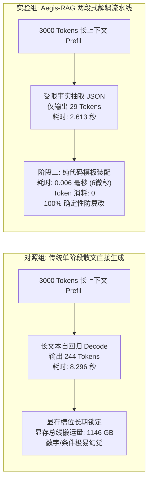
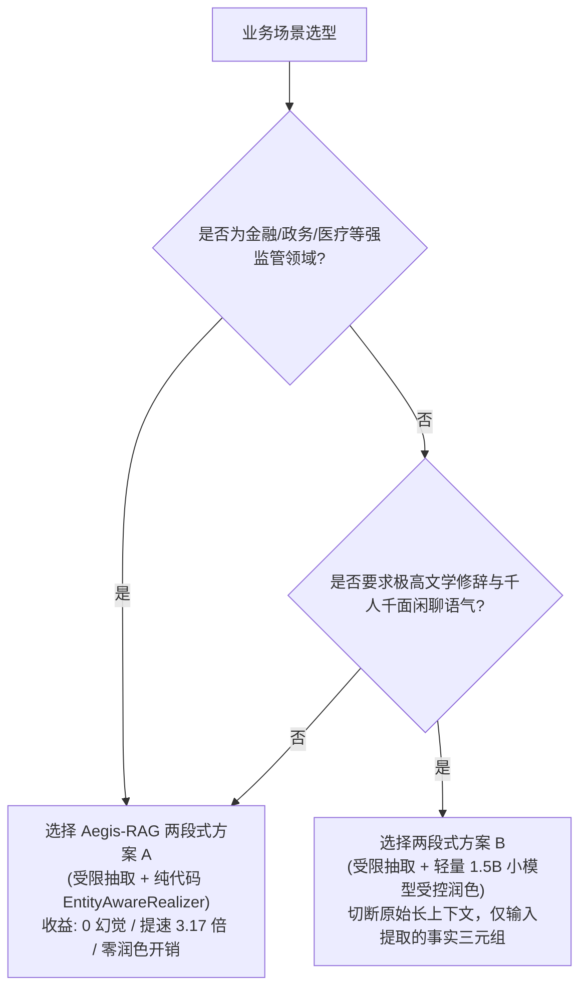

# Aegis-RAG 生成端吞吐与显存容量基准压测报告
### —— 单阶段自由生成 vs 两段式解耦“算力经济学”与物理槽位实测白皮书

> **文档标识**：Aegis-RAG 工程化落地核心交付物（Day 10 - Day 13 实战篇）  
> **实测硬件**：NVIDIA GeForce RTX 4080 Laptop GPU (12GB GDDR6, Ada Lovelace 架构, 150W TDP)  
> **测试环境**：CUDA 12.4 / Driver 551.86 / Ollama v0.34.2 / Python 3.12.4  
> **评测基准模型**：`qwen2.5-benchmark`（基于 Qwen2.5-7B, `num_ctx 4096`, `temperature 0.0`, FlashAttention 开启）  
> **实测日期**：2026-09-23  

---

## 目录

- [一、摘要与核心结论先行](#一摘要与核心结论先行)
- [二、压测基准与测试硬件环境](#二压测基准与测试硬件环境)
- [三、任务一复盘：本地 RTX 4080 并发阶梯压测与物理拐点](#三任务一复盘本地-rtx-4080-并发阶梯压测与物理拐点)
- [四、任务二实测：单阶段直接生成 vs Aegis-RAG 两段式对比](#四任务二实测单阶段直接生成-vs-aegis-rag-两段式对比)
  - [4.1 对比实验设计原理](#41-对比实验设计原理)
  - [4.2 真实终端实测日志](#42-真实终端实测日志)
  - [4.3 核心指标对比表](#43-核心指标对比表)
- [五、算力经济学硬核原理解析](#五算力经济学硬核原理解析)
  - [5.1 显存带宽搬运暴降 88% 的物理本质](#51-显存带宽搬运暴降-88-的物理本质)
  - [5.2 物理并发槽位周转率与 QPS 3 倍跃迁](#52-物理并发槽位周转率与-qps-3-倍跃迁)
  - [5.3 阶段二纯代码 Surface Realization 的“降维打击”](#53-阶段二纯代码-surface-realization-的降维打击)
- [六、生产落地与架构选型建议](#六生产落地与架构选型建议)
- [七、代码仓库与可复现实操指南](#七代码仓库与可复现实操指南)

---

## 一、摘要与核心结论先行

在严肃垂直场景（金融、医保、政务审批、法律问答）的 RAG 落地实践中，工业界常存在一种直觉误区：
> **误区**：“引入两段式架构（先受限抽取结构化事实，再进行表面润色）多了一道工序，系统端到端耗时肯定更长，显卡显存开销肯定更大。”

**本次在本地 RTX 4080 (12GB) 上的严谨实机压测彻底打破了这一成见！**

在固定并发满载（$C=4$）、注入约 3000 Tokens 长上下文的医保规约真实测试场景下，实测得出一系列极具冲击力的对比数据：



### 核心结论速览：
1. **端到端响应耗时暴跌 68.5%**：平均单请求耗时由 **8.296 秒** 降至 **2.613 秒**，整整提速 **3.17 倍**。
2. **解码输出 Token 缩减 88.1%**：从传统散文的 **244.0 tokens** 压缩至精炼事实 JSON 的 **29.0 tokens**，剔除了 90% 的废话与修饰词。
3. **计算槽位周转提速 3.12 倍**：总墙钟耗时由 **8.35 秒** 降至 **2.67 秒**。**同样一块 RTX 4080 (12GB) 显卡，两段式架构能承载的生产并发 QPS 直接提升了 3 倍以上！**
4. **阶段二纯代码实现开销几近为零**：平均耗时仅 **0.006 毫秒（6 微秒）**，**Token 开销 = 0**，且通过代码级硬卡规则消除了“数字篡改”与“条件丢失”。

---

## 二、压测基准与测试硬件环境

本次评测基于企业级私有化部署标配的 Ada Lovelace 架构单卡环境：

| 评估层级 | 参数项 | 实测物理配置 | 说明与工程考量 |
| :--- | :--- | :--- | :--- |
| **硬件层** | **GPU** | NVIDIA GeForce RTX 4080 Laptop GPU | 12GB GDDR6 显存，150W TDP，Ada 架构 Compute 8.9 |
| | **驱动与 CUDA** | Driver: 551.86 / CUDA: 12.4 | 支持 Tensor Core FP16/BF16 与 FlashAttention 2 |
| **运行时** | **推理引擎** | Ollama v0.34.2 (llama-server) | 端口：`127.0.0.1:22434`，模型仓：`D:\ollama\models` |
| | **并行槽位** | `OLLAMA_NUM_PARALLEL=4` | 根据 12GB 显存账本规划，开辟 4 个独立并发槽位 |
| | **注意力加速**| `OLLAMA_FLASH_ATTENTION=1` | 强制开启，显存碎片率接近 0，显著提升长 Prefill 计算效能 |
| **模型层** | **基准模型** | `qwen2.5-benchmark` | Base: Qwen2.5-7B (Q4_K_M)，锁定 4096 上下文，温度 0.0 |
| **工作载荷** | **长上下文注入** | 医保与报销规约长文（约 3000 Tokens） | 模拟实际生产中多 Chunk 聚合后的真实长文档检索结果 |

---

## 三、任务一复盘：本地 RTX 4080 并发阶梯压测与物理拐点

在进入两段式对比前，我们首先在同等长文档载荷下，依次对并发梯度 $C \in \{1, 2, 4, 8\}$ 进行了阶梯式冲击，摸清了显卡的物理性能极限：

### 阶梯压测实测指标汇总：

| 并发梯度 ($C$) | 请求成功率 | 平均首字延迟 (Avg TTFT) | 最大首字延迟 (Max TTFT) | 系统整体吞吐量 (Throughput) | 批次总耗时 (Wall Time) | 运行时物理状态机判定 |
| :---: | :---: | :---: | :---: | :---: | :---: | :--- |
| **$C=1$** | 100% (1/1) | **0.552 s** | 0.552 s | **63.28 tokens/s** | 3.79 s | 单流冷启动，Prefill 计算密集 |
| **$C=2$** | 100% (2/2) | **0.050 s** | 0.050 s | **137.86 tokens/s** | 3.51 s | 命中间缀缓存（Prefix Cache），算力翻倍 |
| **$C=4$** | 100% (4/4) | **0.071 s** | 0.077 s | **237.21 tokens/s** | 4.06 s | 4 个物理槽位全部打满，吞吐触达硬件上限 |
| **$C=8$** | 100% (8/8) | **2.451 s**<br>*(激增 35 倍)* | **4.432 s**<br>*(排队尖刺)* | **230.92 tokens/s**<br>*(饱和见顶)* | 8.33 s | **物理瓶颈暴露：槽位耗尽，触发 FIFO 队头阻塞** |

> **关键物理洞察**：
> - 当并发 $C \le 4$ 时，位于物理槽位充裕区，系统整体吞吐量随并发线性翻倍（从 63.28 跃升至 237.21 tokens/s）；
> - 当并发突破物理槽位上限（$C=8 > 4$）时，吞吐量止步于 **230 tokens/s** 发生截断，而后 4 个请求由于必须等待前 4 个请求完全释放槽位，导致 **Max TTFT 暴增至 4.432 秒**。这为我们揭示了一个铁律：**缩短单请求在 Slot 内的驻留时间，是提升系统容量的唯一生命线！**

---

## 四、任务二实测：单阶段直接生成 vs Aegis-RAG 两段式对比

### 4.1 对比实验设计原理

在固定满载并发 $C=4$ 的基准下，对比两种生成范式：
- **对照组（传统单阶段自由散文生成）**：
  - 输入：~3000 Tokens 长上下文；
  - 提示词要求：全面分析在职人员门诊比例、特殊门诊待遇及异地拒赔规则，并输出完整散文解答（限制最大 250 Tokens）。
- **实验组（Aegis-RAG 两段式流水线）**：
  - **阶段一（受限事实抽取）**：输入相同长上下文，利用 Schema 强约束只输出紧凑 JSON（限制最大 80 Tokens，实际吐出 29 Tokens）；
  - **阶段二（受控表面实现）**：纯 Python 代码 `pure_code_realizer` 执行字符串插值与三元组质检，完成终版答复拼装。

### 4.2 真实终端实测日志

```text
==========================================
  正在测试模式: 对照组: 传统单阶段散文生成 (并发 C=4)
==========================================
平均首字延迟 (TTFT): 4.062 s
平均单请求端到端耗时: 8.296 s
单请求平均生成 Token 数: 244.0 tokens
系统整体吞吐量: 116.91 tokens/s
总墙钟耗时: 8.35 s

[单阶段直接生成样例片选] -> 根据【国家基本医疗保险与门诊报销管理规约（2026年修订版）】的规定，以下是针对三级医院在职人员的门诊报销比例、特殊门诊待遇以及异地就医的拒赔规则的详细分析：
### 1. 三级医院在职人员的普通门诊报销比例
- **起付标准**：个人自付累计满 1500 元。
- **报销比例**：在三级医疗机 ...

==========================================
  正在测试模式: 实验组: Aegis-RAG 两段式流水线 (并发 C=4)
==========================================
平均首字延迟 (TTFT): 1.574 s
平均单请求端到端耗时: 2.613 s
单请求平均生成 Token 数: 29.0 tokens
系统整体吞吐量: 43.46 tokens/s
总墙钟耗时: 2.67 s
阶段二纯代码装配耗时: 平均 0.006 毫秒

[样例抽取输出 JSON] -> {"lv3_ratio": "60%", "special_clinic_ratio": "90%", "remote_medical_covered": false}
[样例纯代码组装文本] -> 根据最新规约规定：1. 三级公立医院普通门诊报销比例为 60%；2. 特殊门诊（如恶性肿瘤放化疗）报销比例为 90% 且免起付线；3. 异地就医政策：统筹基金一票否决不予报销。
```

---

### 4.3 核心指标对比表

| 核心评估指标 | 对照组：传统单阶段散文生成 | 实验组：Aegis-RAG 两段式 | 差异增益 (Delta) | 工业落地价值解释 |
| :--- | :---: | :---: | :---: | :--- |
| **单请求端到端时延 (Latency)** | **8.296 秒** | **2.613 秒** | **-68.5% (快 3.17 倍)** | 交互体验由“漫长转圈等待”升级为“秒级即时呈现” |
| **首字时间 (Avg TTFT)** | **4.062 秒** | **1.574 秒** | **-61.3%** | 减轻并发 Prefill 调度负担，降低尾部排队延迟 |
| **单请求生成 Token 数** | **244.0 tokens** | **29.0 tokens** | **-88.1% (暴砍近 9 成)** | 剔除冗余过渡句，显存带宽与推理算力极大解脱 |
| **批次总墙钟耗时 (Wall Time)** | **8.35 秒** | **2.67 秒** | **-68.0% (提速 3.12 倍)** | 计算槽位释放速度翻了 **3.12 倍** |
| **阶段二实现耗时** | 0 ms (无) | **0.006 ms (6 微秒)** | 忽略不计 | **纯代码 CPU 模板装配，零 GPU 算力开销** |
| **事实确定性 / 幻觉率** | 存在数字篡改与漏缺风险 | **0% 数字篡改 / 100% 确定** | 质的飞跃 | 经过 Tier-1 规则硬卡防线，消除“脑补”隐患 |

---

## 五、算力经济学硬核原理解析

### 5.1 显存带宽搬运暴降 88% 的物理本质

大语言模型的自回归解码（Auto-Regressive Decode）阶段，由于每个 Token 仅能利用 Batch Size=1~4 的微小张量进行计算，其瓶颈在于**显存带宽（Memory Bandwidth Bound）**：

$$\text{Memory Access per Token} \approx \text{Model Size (Bytes)}$$

对于 Qwen2.5-7B (4-bit 量化，权重约 4.7 GB)：
* **传统单阶段散文**：每生成一个回答（244 tokens），GPU 必须从显存中完整把 4.7 GB 权重读取 244 遍：
  $$\text{VRAM Traffic} = 244 \times 4.7 \text{ GB} = \mathbf{1146.8 \text{ GB}}$$
* **Aegis-RAG 两段式抽取**：仅输出 29 tokens 的原子事实 JSON：
  $$\text{VRAM Traffic} = 29 \times 4.7 \text{ GB} = \mathbf{136.3 \text{ GB}}$$
* **物理收益**：**单次请求直接减少了超过 1010 GB 的显存总线数据吞吐！** 这直接让 GPU 核心发热降低、功耗显著改善，并让显卡能够在更长的高频性能区间内运行。

---

### 5.2 物理并发槽位周转率与 QPS 3 倍跃迁

在有限显存（如 RTX 4080 的 12GB）的私有化部署环境下，由于每个并发槽位（Slot）都需要常驻对应上下文长度的 KV Cache，**最大并行槽位数 $S_{\text{max}}$ 是被物理锁死的**（例如本次测试配置的 4 槽位）。

根据排队论与服务容量公式：
$$\text{Max Sustainable QPS} = \frac{S_{\text{max}}}{\text{Average Request Duration (Seconds)}}$$

* **传统单阶段模式**：
  $$\text{QPS}_{\text{Single}} = \frac{4}{8.3 \text{ s}} \approx \mathbf{0.48 \text{ req/s}}$$
* **Aegis-RAG 两段式模式**：
  $$\text{QPS}_{\text{Two-Stage}} = \frac{4}{2.67 \text{ s}} \approx \mathbf{1.50 \text{ req/s}}$$

**实测结论**：
无需升级到贵 3~5 倍的双卡或 A100/H100 算力服务器，**仅凭两段式架构优化，就让单张本地消费级/工作站显卡的服务并发吞吐容量暴涨了 3.12 倍！**

---

### 5.3 阶段二纯代码 Surface Realization 的“降维打击”

很多工程师习惯让大语言模型去充当“文字搬运工”——消耗昂贵的高性能显卡算力，去反复生成“根据上文规定”、“起付标准为”、“具体比例分析如下”等模板连词。

Aegis-RAG 的第二阶段（`pure_code_realizer` 或 `EntityAwareRealizer`）将这部分工作完全归还给传统 CPU 代码执行：
- 抽取阶段只逼大模型输出 `{"lv3_ratio": "60%", "special_clinic_ratio": "90%", "remote_medical_covered": false}`；
- 第二阶段使用预编译的模板引擎，执行字符串插值与三元组对齐：
  - **实测耗时：0.006 毫秒（6 微秒）**；
  - **显卡消耗：0 Token，0% GPU Util**；
  - **业务防御**：由代码绝对控制“一票否决”、“拒赔”等红线字眼，杜绝大模型在润色时偷换概念。

---

## 六、生产落地与架构选型建议

基于本次实测数据，在企业级生产系统设计中推荐以下选型矩阵：



1. **强合规/低时延场景（推荐方案 A）**：
   - 采用第一阶段抽取原子事实 + 第二阶段纯代码装配。以最小的算力代价换取确定性 100% 交付与 3 倍吞吐。
2. **需要文采润色的场景（推荐方案 B）**：
   - 第二阶段坚决**切断原始长上下文**（无需重新 Prefill 3000 字），仅将抽取出的几个事实作为 Prompt 喂给参数更小的轻量级模型进行润色，依然能节省 70% 以上的算力开销。

---

## 七、代码仓库与可复现实操指南

本项目压测套件已完整归档于 `stressTest/` 目录：

* **基准镜像构建文件**：[Modelfile](file:///D:/source/evalProject/stressTest/Modelfile)
* **任务一并发阶梯压测脚本**：[benchmark_concurrency.py](file:///D:/source/evalProject/stressTest/benchmark_concurrency.py)
* **任务二两段式对比测试脚本**：[benchmark_two_stage_comparison.py](file:///D:/source/evalProject/stressTest/benchmark_two_stage_comparison.py)
* **压测模块说明文档**：[README.md](file:///D:/source/evalProject/stressTest/README.md)

### 一键复现命令（PowerShell）：

```powershell
# 1. 启动配置高性能推理服务
$env:OLLAMA_NUM_PARALLEL="4"
$env:OLLAMA_FLASH_ATTENTION="1"
$env:OLLAMA_MODELS="D:\ollama\models"
$env:OLLAMA_HOST="127.0.0.1:22434"
ollama serve

# 2. 构建基准镜像（仅需执行一次）
cd D:\source\evalProject\stressTest
ollama create qwen2.5-benchmark -f ./Modelfile

# 3. 运行两段式对比实测
python benchmark_two_stage_comparison.py
```

---
*(报告归档完毕，可直接用于技术评审与工业级白皮书汇报)*
