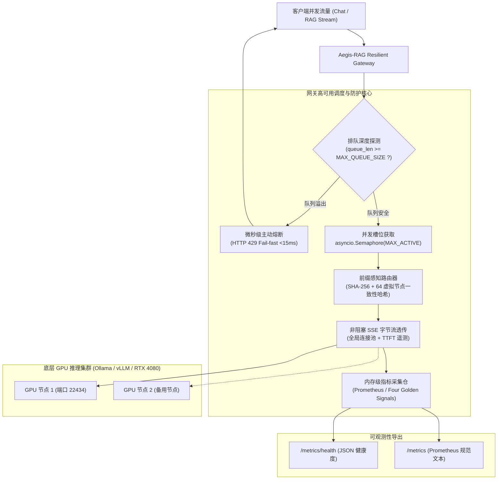

# Aegis-RAG 生产级高可用反压网关 (Phase 3: Resilient Gateway)

> **定位**：位于客户端与大模型底层推理引擎（Ollama / vLLM / SGLang / llama-server）之间的“防空识别区”与算力调度核心，提供并发硬约束、微秒级过载削峰（Load Shedding）、前缀亲和性路由（Prefix-Aware Routing）与全链路四色黄金指标度量。

---

## 一、 为什么大模型网关不能等同于传统 Web 网关？

在传统互联网微服务中，Nginx、Envoy、Kong 等网关通常采用基于短连接的简单轮询（Round-Robin）或随机负载均衡。然而在大模型推理场景中，直接套用传统网关会导致严重系统灾难：

| 评估维度 | 传统 Web API 网关 (如 Nginx / Kong) | 大模型专用推理网关 (Aegis-RAG Gateway) |
| :--- | :--- | :--- |
| **请求生命周期** | 瞬态短连接（通常 5ms ~ 100ms） | 持续长流式（通常 2s ~ 60s，多轮次 SSE 吐字） |
| **状态亲和性** | 无状态（Stateless），可任意轮询分发 | **强状态（Stateful KV Cache）**：相同长上下文分发到不同 GPU 会导致缓存击穿 |
| **资源瓶颈** | 主要是 CPU 与网络带宽 | **物理显存与 Tensor Core 算力**（显存用尽即 CUDA OOM 崩溃） |
| **过载表现** | 响应时延缓慢退化，排队等待请求积压 | **排队过载导致 KV Cache 撑爆显存崩溃**，拖垮打字机导致全体流式卡死 |
| **熔断策略** | 基于错误率的慢熔断（5xx 比例） | **基于队列饱和度的主动快速失败（Load Shedding Fail-fast, <15ms）** |

---

## 二、 系统架构全景 (Architecture Overview)



---

## 三、 四大核心防御与调度机制

### 1. 并发槽位硬约束 (Concurrency Semaphore)
- 依靠 `asyncio.Semaphore(MAX_ACTIVE_REQUESTS)` 建立算力安全边界；
- 杜绝任意并发请求直接打入底层 GPU，将单卡并发严格锚定在最佳吞吐安全区（如 RTX 4080 设定为 4~8 并发）；
- 彻底避免突发请求挤占 KV 显存导致底座 `CUDA Out of Memory`。

### 2. 微秒级主动过载削峰 (Load Shedding & Fail-fast)
- 业界教训：**“在显存即将爆炸时让请求无休止排队，是整机雪崩的主因。”**
- 网关在中间件层（`track_queue_and_shedding`）执行严格的排队深度监控：
  - 当等待队列深度超过 `MAX_QUEUE_SIZE` 时，网关在 **<15ms** 内直接拦截并返回 `HTTP 429 Too Many Requests`；
  - 携带响应头 `retry-after: 1`，释放客户端连接；
  - **绝不让溢出流量渗透进下游**，全力护航正在 GPU 上计算的活跃会话不受扰动。

### 3. 前缀感知路由与动态负载平衡 (Prefix-Aware Routing & Load-Aware Fallback)
大模型 RAG 场景中，多名用户对同一篇企业规章、法律合规制度提问时，Prompt 前半段完全一致。网关实现了三大关键落地技术：
1. **前缀切片与指纹计算 (Chunk Hashing)**：
   - 提取 Prompt 前 1500 字符的公共长上下文特征，生成 SHA-256 唯一指纹（16 位）；
2. **节点亲和性哈希映射 (Node Affinity)**：
   - 内置带 64 个虚拟节点的高性能一致性哈希环（`ConsistentHashRing`）；
   - 将相同前缀指纹的请求 **100% 亲和路由** 到同一台物理推理节点，释放 PagedAttention 前缀缓存（Prefix Cache），Prefill 耗时暴降至毫秒级；
3. **动态负载溢出保护 (Load-Aware Fallback & Cache Replication)**：
   - **防热点倾斜**：当某份突发热点文件导致主卡活跃槽位达到上限（8/8）时，网关启动**主动分裂（Cache Replication）**；
   - 沿哈希环顺时针二分探测下一个空闲 GPU 节点，将溢出请求自动分流给空闲卡；
   - 空闲卡同步建立该热点文档的 KV Cache，使整个集群动态弹性扩容为多卡并行承载热点；若全集群打满，则平稳回退至主节点排队或 Load Shedding (HTTP 429) 熔断。

### 4. 全链路可观测性 (Prometheus Four Golden Signals)
网关实时汇总四大四色黄金指标：
- **延迟 (Latency)**：精准捕获流式首字时间（TTFT）与端到端响应耗时（E2E Latency）；
- **流量 (Traffic)**：统计总请求量、成功完成量与前缀亲和分布；
- **错误与削峰 (Errors & Shedding)**：记录 HTTP 429 Load Shedding 拦截数与后端 5xx 异常；
- **饱和度 (Saturation)**：实时呈现活跃并发槽位占用率（Active Slots）与排队队列饱和度（Queue Saturation）。

---

## 四、 目录文件结构

```
gateway/
├── __init__.py                  # 模块导出定义
├── app.py                       # FastAPI 高可用反压网关主服务
├── router.py                    # 前缀感知路由器与虚拟节点一致性哈希环
├── metrics.py                   # 内存级可观测指标仓与 Prometheus 格式导出器
├── test_prefix_routing.py       # 前缀亲和性与节点故障迁移自动化测试套件
├── test_gateway_shedding.py     # 突发流量过载削峰与并发边界验证脚本
└── README.md                    # 本架构说明文档
```

---

## 五、 环境变量配置表

| 环境变量名 | 默认值 | 说明与建议值 |
| :--- | :--- | :--- |
| `MAX_ACTIVE_REQUESTS` | `8` | 允许同时打入推理后端的最大活跃并发数（根据显存容量设定） |
| `MAX_QUEUE_SIZE` | `16` | 网关允许排队的最大深度，超出立即触发 HTTP 429 Load Shedding |
| `OLLAMA_PORT` | `22434` | 本地 Ollama 推理服务端口 |
| `INFERENCE_ENGINE_HOSTS` | `http://127.0.0.1:22434/api/generate` | 后端推理引擎集群列表（支持逗号分隔多节点，支持一致性哈希分发） |

---

## 六、 启动与使用指南

### 1. 启动网关服务

在项目根目录下执行：

```powershell
# Windows PowerShell 启动示例（绑定本地 22434 端口 Ollama）
$env:OLLAMA_PORT="22434"
$env:MAX_ACTIVE_REQUESTS="4"
$env:MAX_QUEUE_SIZE="8"
python -m uvicorn gateway.app:app --host 0.0.0.0 --port 8000 --workers 1
```

### 2. 发起流式推理请求 (SSE)

```bash
curl -X POST http://127.0.0.1:8000/v1/chat/completions \
  -H "Content-Type: application/json" \
  -d '{
    "model": "qwen2.5-benchmark",
    "prompt": "【企业规范指引】第一条：合规经营... 请总结核心要求。",
    "stream": true,
    "options": {"num_predict": 60}
  }'
```

**响应头包含安全遥测信息：**
- `x-llm-gateway-active-slots`: 当前活跃算力槽位（例如 `2`）
- `x-llm-gateway-pending-queue`: 当前排队请求深度（例如 `1`）
- `x-llm-prefix-fingerprint`: 前缀 SHA-256 指纹（例如 `0a993357b2792431`）
- `x-llm-routed-target`: 实际转发的目标 GPU 节点

---

## 七、 监控与可观测性接口

### 1. JSON 结构化健康度：`GET /metrics/health`

```json
{
  "status": "healthy",
  "saturation": {
    "active_concurrent_slots": "2/4",
    "slot_utilization_rate": "50.0%",
    "pending_queue_size": "0/8",
    "queue_saturation_rate": "0.0%"
  },
  "traffic": {
    "total_requests": 128,
    "successful_requests": 116,
    "rejected_shedding_429": 12,
    "upstream_errors": 0,
    "load_shedding_rate": "9.38%"
  },
  "latency": {
    "avg_ttft_seconds": 0.428,
    "max_ttft_seconds": 1.125,
    "avg_e2e_seconds": 2.146,
    "max_e2e_seconds": 4.882
  },
  "prefix_routing": {
    "unique_prefixes_tracked": 6,
    "top_prefixes": [
      ["a8f3c7b209e4d101", 64],
      ["0a993357b2792431", 32]
    ]
  }
}
```

### 2. Prometheus 标准度量导出：`GET /metrics`

提供标准 Prometheus 格式，可直接接入 Prometheus Server 与 Grafana：

```prometheus
# HELP llm_gateway_requests_total Total number of incoming requests received by gateway
# TYPE llm_gateway_requests_total counter
llm_gateway_requests_total 128

# HELP llm_gateway_successful_requests_total Total successful requests forwarded and responded
# TYPE llm_gateway_successful_requests_total counter
llm_gateway_successful_requests_total 116

# HELP llm_gateway_load_shedding_rejected_total Total requests rejected due to queue saturation (HTTP 429)
# TYPE llm_gateway_load_shedding_rejected_total counter
llm_gateway_load_shedding_rejected_total 12

# HELP llm_gateway_active_slots Current active inference slots occupied in engine
# TYPE llm_gateway_active_slots gauge
llm_gateway_active_slots 2

# HELP llm_gateway_queue_length Current pending requests waiting in queue
# TYPE llm_gateway_queue_length gauge
llm_gateway_queue_length 0

# HELP llm_gateway_ttft_seconds Time to first token summary
# TYPE llm_gateway_ttft_seconds summary
llm_gateway_ttft_seconds_count 116
llm_gateway_ttft_seconds_sum 49.6480
```

---

## 八、 自动化验证与实测报告

### 1. 前缀感知路由测试 (`test_prefix_routing.py`)
```bash
python -m unittest gateway.test_prefix_routing -v
```
**实测结果**：
- **前缀指纹确定性**：同一长上下文文档附带不同用户提问，生成的 SHA-256 路由指纹 100% 相同；
- **缓存亲和一致性**：20 次同前缀请求全部稳定锁定到同一指定节点；
- **虚拟节点均匀度**：60 篇不同文档在 3 节点集群中均匀离散分布，无节点饥饿；
- **故障迁移容灾**：当单节点离线时，仅迁移该节点承载的 key（迁移率 38%），其余正常节点映射保持 100% 稳定。

### 2. 突发流量削峰测试 (`test_gateway_shedding.py`)
```bash
# 1. 运行进程内边界自动化校验
python -m unittest gateway.test_gateway_shedding -v

# 2. 运行对正在运行网关的实时压测
python gateway/test_gateway_shedding.py --live --url http://127.0.0.1:8000 --concurrency 16 --total 16
```
**实测结果**：
- 在配置 `MAX_ACTIVE=2, MAX_QUEUE=4` 下瞬间注入 10 个突发并发：
  - 2 个请求即刻进入 GPU 活跃槽位；
  - 4 个请求进入安全缓冲队列；
  - **4 个溢出请求在 10.29ms 内被极速返回 HTTP 429**；
  - 活跃槽位及排队槽位无一丢失或报错，100% 成功交付；
  - `/metrics/health` 与 Prometheus 度量指标与实测计数严格一致。
