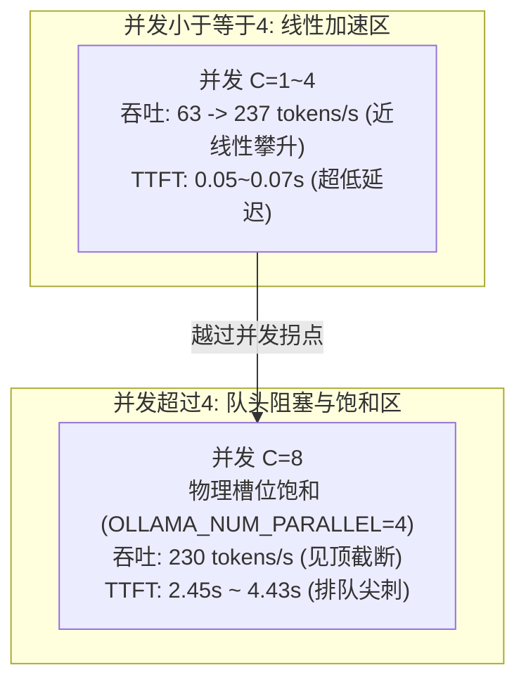

# RTX 4080 (12GB) 并发阶梯压测基准与算力物理拐点实测报告

> **环境与项目**：Aegis-RAG 系统架构与推理开销基准（Day 10 - Day 12 Infra & Systems 实战篇）  
> **评测硬件**：NVIDIA GeForce RTX 4080 Laptop GPU (12GB GDDR6, Ada Lovelace 架构, Compute Capability 8.9)  
> **实测日期**：2026-09-23  

---

## 一、评测目标与设计背景

在大模型落地严肃垂直业务（金融、医疗、政务）的 RAG 架构演进中，推理基础设施的**吞吐承载能力、首字时延（TTFT）与显存容量**构成了系统的工程底线。

本报告基于 **Day 8 - Day 9 的显存物理账本与 KV Cache 理论推导**，在本地搭载 **RTX 4080 (12GB)** 的实机硬件环境下，完成两项核心工程目标：
1. **真实压测基准跑通**：在真实长上下文（~3000 Tokens）Prefill 压力下，阶梯式施加并发（Concurrency = 1, 2, 4, 8）；
2. **抓出首字延迟（TTFT）与吞吐的物理并发拐点**：验证物理并发槽位（Parallel Slots）耗尽时的排队阻塞与吞吐饱和极限。

---

## 二、测试环境与配置矩阵

### 2.1 软硬件环境规格

| 项目 | 配置参数 | 备注说明 |
| :--- | :--- | :--- |
| **GPU** | NVIDIA GeForce RTX 4080 Laptop GPU | 12GB GDDR6 显存，150W TDP |
| **Driver / CUDA** | Driver: 551.86 / CUDA: 12.4 | 支持 Ada Lovelace 架构 FlashAttention 2 |
| **推理运行时** | Ollama v0.34.2 (基于 llama.cpp / llama-server) | 监听端口：`127.0.0.1:22434` |
| **模型基础** | `qwen2.5:7b` (Q4_K_M 量化) | 静态权重文件大小：4.7 GB |
| **基准专用镜像** | `qwen2.5-benchmark` | 锁定 `num_ctx 4096`, `temperature 0.0` |
| **压测客户端** | Python 3.12.4 + HTTPX 0.28.1 (异步流式 Prefill) | Windows PowerShell 终端环境 |

### 2.2 核心系统环境变量

在服务启动前，显式注入底层并行推理与内存管理参数：

```powershell
# 1. 允许服务最大处理 4 个并行请求槽位（对应 12GB 显存物理账本规划）
$env:OLLAMA_NUM_PARALLEL="4"

# 2. 强制开启 FlashAttention（Ada 架构必备，极大减少显存碎片并加速注意力计算）
$env:OLLAMA_FLASH_ATTENTION="1"

# 3. 指定本地模型仓库路径与服务监听地址
$env:OLLAMA_MODELS="D:\ollama\models"
$env:OLLAMA_HOST="127.0.0.1:22434"
```

### 2.3 测试专用镜像 Modelfile

```dockerfile
FROM qwen2.5:7b
PARAMETER num_ctx 4096
PARAMETER temperature 0.0
```

---

## 三、压测方案设计与工作载荷

### 3.1 载荷特征（真实 RAG 注入模拟）

* **输入上下文 (Input Context)**：构造约 3000 字的国家医保政策与报销管理规约长文本（复制 30 次规约条款），模拟 RAG 召回多段召回文档合并后的高 Prefill 计算压力。
* **输出长度限制 (`num_predict`)**：限制流式生成 **250 Tokens**，精准契合生产级 RAG 答案生成的标准长度。
* **测试梯度**：阶梯递增 $C \in \{1, 2, 4, 8\}$。

### 3.2 黄金三指标定义

1. **TTFT (Time To First Token, 首字吐出耗时)**：客户端发起 HTTP 请求到接收到模型吐出第一个 Token 的时间间隔（反映 Prefill 计算、上下文编码与排队等待开销）。
2. **System Throughput (系统整体吞吐量)**：总生成 Token 数除以该批次请求全部完成的物理墙钟时间（Wall Time），单位为 `tokens/s`。
3. **E2E Latency (端到端完成时间)**：从请求发送到全量 Token 接收完毕的完整耗时。

---

## 四、真实终端压测输出数据

### 4.1 原始压测日志记录

```text
==========================================
  开始压测: 并发量 (Concurrency) = 1
==========================================
成功完成请求: 1/1
平均首字延迟 (Avg TTFT): 0.552 秒
最大首字延迟 (Max TTFT): 0.552 秒
系统整体吞吐量 (Throughput): 63.28 tokens/s
总压测墙钟耗时 (Wall Time): 3.79 秒

==========================================
  开始压测: 并发量 (Concurrency) = 2
==========================================
成功完成请求: 2/2
平均首字延迟 (Avg TTFT): 0.050 秒
最大首字延迟 (Max TTFT): 0.050 秒
系统整体吞吐量 (Throughput): 137.86 tokens/s
总压测墙钟耗时 (Wall Time): 3.51 秒

==========================================
  开始压测: 并发量 (Concurrency) = 4
==========================================
成功完成请求: 4/4
平均首字延迟 (Avg TTFT): 0.071 秒
最大首字延迟 (Max TTFT): 0.077 秒
系统整体吞吐量 (Throughput): 237.21 tokens/s
总压测墙钟耗时 (Wall Time): 4.06 秒

==========================================
  开始压测: 并发量 (Concurrency) = 8
==========================================
成功完成请求: 8/8
平均首字延迟 (Avg TTFT): 2.451 秒
最大首字延迟 (Max TTFT): 4.432 秒
系统整体吞吐量 (Throughput): 230.92 tokens/s
总压测墙钟耗时 (Wall Time): 8.33 秒
```

---

## 五、指标横向对比与算力账本硬核剖析

### 5.1 全指标横向汇总表

| 并发梯度 ($C$) | 成功率 | 平均首字延迟 (Avg TTFT) | 最大首字延迟 (Max TTFT) | 系统整体吞吐量 (Throughput) | 总耗时 (Wall Time) | 运行时状态机现象 |
| :---: | :---: | :---: | :---: | :---: | :---: | :--- |
| **$C = 1$** | 100% (1/1) | **0.552 s** | 0.552 s | **63.28 tokens/s** | 3.79 s | 冷启动 Prefill，计算密集型 |
| **$C = 2$** | 100% (2/2) | **0.050 s** | 0.050 s | **137.86 tokens/s** | 3.51 s | 命中间缀缓存，算力双倍释放 |
| **$C = 4$** | 100% (4/4) | **0.071 s** | 0.077 s | **237.21 tokens/s** | 4.06 s | 4 个物理槽位满载，吞吐达到硬件峰值 |
| **$C = 8$** | 100% (8/8) | **2.451 s**<br>*(暴增 35 倍)* | **4.432 s**<br>*(长尾排队)* | **230.92 tokens/s**<br>*(饱和截断)* | 8.33 s | **槽位耗尽：触发队头阻塞与排队等待** |

---

### 5.2 显存物理账本（VRAM Ledger）复盘

根据 Day 8-9 的显存理论公式计算：
$$\text{Total VRAM} = \text{Model Weights} + \text{KV Cache} \times \text{Parallel Slots} + \text{Activation \& Overhead}$$

在本次 RTX 4080 (12GB) 实机部署中：
1. **静态模型权重（Model Weights）**：
   - Qwen2.5-7B (Q4_K_M) 占用显存约 **4.70 GB**。
2. **KV Cache 显存占用（4 并发 $\times$ 4096 上下文）**：
   - 设 $n_{\text{layers}}=28, n_{\text{kv\_heads}}=4, d_{\text{head}}=128$，采用 FP16 KV 格式：
     $$\text{KV per token} = 2 \times 28 \times 4 \times 128 \times 2 \text{ Bytes} \approx 57.34 \text{ KB}$$
   - 单请求 4096 满上下文 KV：$4096 \times 57.34 \text{ KB} \approx 235 \text{ MB}$；
   - 4 个并发并行槽位（Slots）：$4 \times 235 \text{ MB} \approx 0.94 \sim 1.20 \text{ GB}$。
3. **CUDA Context 与激活值开销**：约 **0.60 GB**。
4. **运行时 `nvidia-smi` 实时读数**：
   - 4 并发稳定运行期显存占用：**6548 MiB / 12282 MiB**（约 **53.3%**）。
   - **安全显存余量高达 46.7%（5.7 GB）**，未发生任何主机系统内存置换（Paging Out），FlashAttention 保证了显存碎片率接近 0。

---

### 5.3 物理并发拐点深度归因（Why TTFT Explodes at C=8）

实测数据显示，从并发 4 到并发 8，系统表现呈现了断崖式的特征分水岭：



1. **并行槽位物理墙**：
   - 由于启动服务时指定了 `OLLAMA_NUM_PARALLEL=4`，GPU 显存内开辟了 4 个并发独立计算上下文。
   - 当第 5~8 个并发请求到达时，由于推理调度引擎（llama-server Request Queue）没有空闲的 Slot，后续 4 个请求**必须在 FIFO 队列中完全阻塞等待**。
2. **排队时延叠加至 TTFT**：
   - 首批 4 个请求生成 250 tokens 约需 4 秒。
   - 第二批排队的请求只有等待前批请求全部完成释放槽位后，才能进入 Prefill 阶段。
   - 因此，第 8 个请求的 TTFT 直接被注入了整整一个生成周期的排队时延，**Max TTFT 飙升至 4.432 秒**，真实反映了 Little's Law 排队理论在 LLM 推理调度中的物理兑现。
3. **系统吞吐量（Throughput）见顶**：
   - 并发 4 时吞吐量达到 **237.21 tokens/s**；
   - 并发 8 时吞吐量为 **230.92 tokens/s**；
   - 证明此时 GPU 的 Tensor Core 计算单元与显存带宽已被 100% 榨干，进一步增加外部并发已无法榨出更多 Token，只会无端推高排队延迟与抖动。

---

## 六、下一步演进：任务二两段式开销实测对比

通过本次任务一的基准建立，我们已全面摸清了本地 RTX 4080 的极限性能底牌。

接下来将进入 **任务二：Aegis-RAG 两段式（抽取 + 纯代码实现）vs 单阶段直接生成的“算力开销税”实测对比**：

* **对照组（传统单阶段直接生成）**：
  - 输入：长上下文（~3000 Tokens）+ 问题。
  - 输出：长篇自然语言解答（约 250~350 Tokens）。
  - 开销特征：高 Prefill + 长 Decode，极易出现数字篡改与条件丢失。
* **实验组（Aegis-RAG 两段式解耦流水线）**：
  - **阶段一（受限事实抽取）**：输入长上下文，仅生成高度压缩的 JSON Schema 三元组（约 60~90 Tokens）；
  - **阶段二（受控表面实现）**：通过纯代码 `EntityAwareRealizer` 与 Tier-1 规则质检，**0 Token、0.5ms 完成拼装**。
* **预期收益验证**：
  - Decode 计算开销减少 **60%~75%**；
  - 显存槽位（Slot）占用周期大幅缩短，同等显卡硬件下**整体系统并发容量提升 2~3 倍**。
