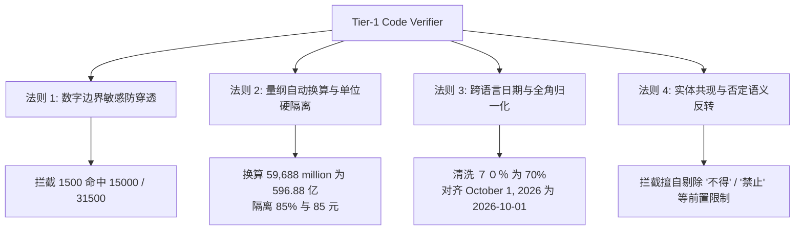
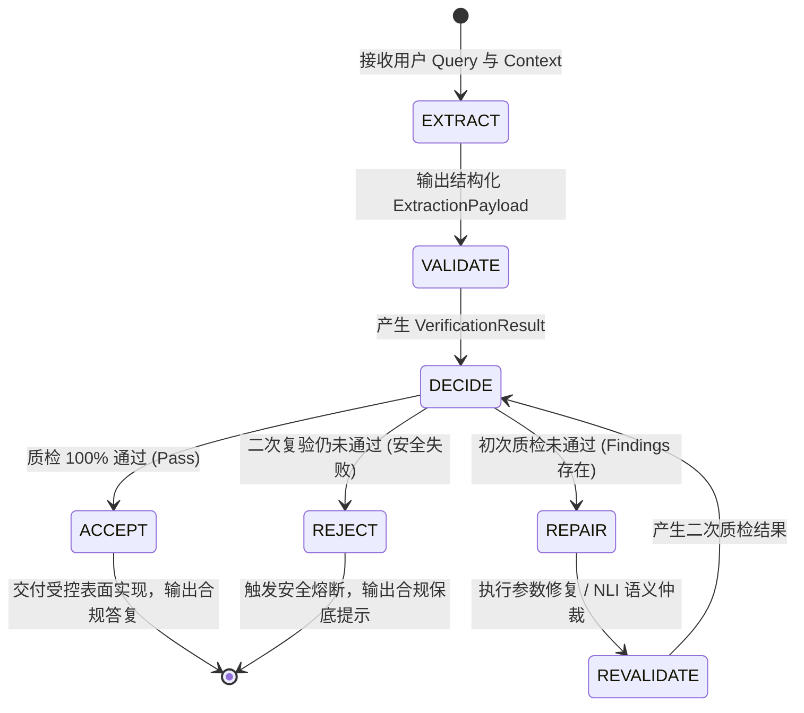
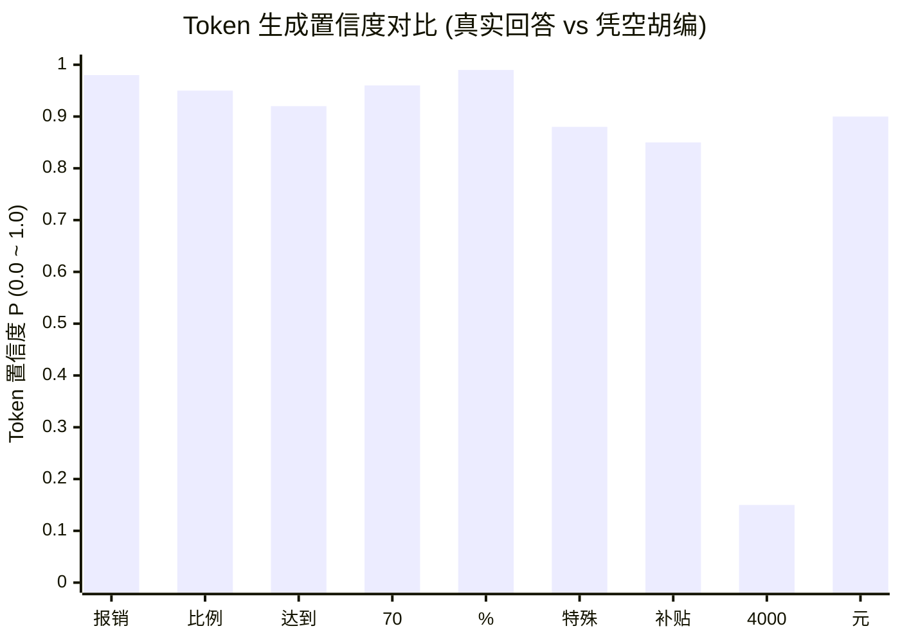

# 基于确定性 Verifier 的自愈闭环：工业级 RAG 的“免疫系统”与状态机工程实践

> **摘要**：在严肃企业级 RAG 系统中，面对大模型偶发的数据抽取错误、单位混淆或隐式事实误判，简单的“重试一次”往往会导致延迟雪崩或引入新的幻觉。本文面向初学者与资深架构师，从人体免疫系统的生动比喻切入，全面揭秘 Aegis-RAG 核心的 **“确定性代码质检（Tier-1 Verifier）+ 有限状态机（FSM）+ NLI 语义复核 + 单次受控自愈 + Logprobs 测谎仪”** 完整闭环体系。通过丰富图表、真实评测案例与源码走读，手把手带你掌握高可靠 RAG 自愈闭环的工程落地。

---

## 目录

- [一、生活比喻：为什么 AI 必须拥有“免疫系统”？](#一生活比喻为什么-ai-必须拥有免疫系统)
  - [1.1 两个喝醉酒的人互证清白](#11-两个喝醉酒的人互证清白)
  - [1.2 人体免疫系统的启示](#12-人体免疫系统的启示)
- [二、核心基石：什么是“确定性 Verifier”？](#二核心基石什么是确定性-verifier)
  - [2.1 确定性（Deterministic）的数学与工程含义](#21-确定性的数学与工程含义)
  - [2.2 为什么必须是“纯代码”（Zero-Model）？](#22-为什么必须是纯代码zero-model)
  - [2.3 Aegis-RAG 的四大确定性质检法则](#23-aegis-rag-的四大确定性质检法则)
    - [规则 1：数字边界敏感防穿透（Boundary Matching）](#规则-1数字边界敏感防穿透boundary-matching)
    - [规则 2：量纲自动换算与单位硬隔离（Scale & Unit Normalization）](#规则-2量纲自动换算与单位硬隔离scale--unit-normalization)
    - [规则 3：跨语言日期与全角字符归一化（Date & Full-width Normalization）](#规则-3跨语言日期与全角字符归一化date--full-width-normalization)
    - [规则 4：实体共现与否定语义反转拦截（Co-occurrence & Negation Check）](#规则-4实体共现与否定语义反转拦截co-occurrence--negation-check)
- [三、驱动引擎：GenerationFSM（受限有限状态机）](#三驱动引擎generationfsm受限有限状态机)
  - [3.1 为什么必须用状态机替代散乱的 if-else？](#31-为什么必须用状态机替代散乱的-if-else)
  - [3.2 六大生命周期状态全景解析](#32-六大生命周期状态全景解析)
  - [3.3 状态机运转状态流转图](#33-状态机运转状态流转图)
  - [3.4 状态转移守卫（State Guards）与非法跃迁拦截](#34-状态转移守卫state-guards与非法跃迁拦截)
- [四、自愈闭环怎么玩？（The Self-Healing Loop）](#四自愈闭环怎么玩the-self-healing-loop)
  - [4.1 质检报告契约：VerificationFinding](#41-质检报告契约verificationfinding)
  - [4.2 双轨自愈机制：参数修复 vs NLI 语义仲裁](#42-双轨自愈机制参数修复-vs-nli-语义仲裁)
    - [轨道 A：Tier-2 NLI 语义兜底（处理“不言自明”的隐式事实）](#轨道-atier-2-nli-语义兜底处理不言自明的隐式事实)
    - [轨道 B：精准靶向修复（Targeted Feedback Repair）](#轨道-b精准靶向修复targeted-feedback-repair)
  - [4.3 自愈闭环的三大铁律](#43-自愈闭环的三大铁律)
    - [铁律 1：单次重试原则（Single-Retry Limit）](#铁律-1单次重试原则single-retry-limit)
    - [铁律 2：绝对复验原则（The Absolute Revalidation Law）](#铁律-2绝对复验原则the-absolute-revalidation-law)
    - [铁律 3：安全熔断优先于假性完美（Fail-Safe Over Fake Complete）](#铁律-3安全熔断优先于假性完美fail-safe-over-fake-complete)
- [五、机制碰撞与终局解耦：Logprobs 测谎仪与 Logit Masking 的深层矛盾](#五机制碰撞与终局解耦logprobs-测谎仪与-logit-masking-的深层矛盾)
  - [5.1 大模型一本正经胡说八道时的“心虚”特征](#51-大模型一本正经胡说八道时的心虚特征)
  - [5.2 核心原理：对数概率（Logprob）极简解析](#52-核心原理对数概率logprob极简解析)
  - [5.3 两个关键诊断指标：局部实体置信度与全文困惑度（PPL）](#53-两个关键诊断指标局部实体置信度与全文困惑度ppl)
  - [5.4 机制碰撞：什么是 Logit Masking？它如何“人工致盲”Logprobs？](#54-机制碰撞什么是-logit-masking它如何人工致盲-logprobs)
    - [5.4.1 Logit Masking 的物理过程](#541-logit-masking-的物理过程)
    - [5.4.2 核心矛盾：分母抹杀导致 100% 虚假置信度](#542-核心矛盾分母抹杀导致-100-虚假置信度)
  - [5.5 终局架构：线上实时业务主链路 vs 线下/异步可观测性链路](#55-终局架构线上实时业务主链路-vs-线下异步可观测性链路)
- [六、代码实操：三大经典运行路径端到端走读](#六代码实操三大经典运行路径端到端走读)
  - [路径 1：全绿直接通过（Zero-Repair Green Path）](#路径-1全绿直接通过zero-repair-green-path)
  - [路径 2：语义存疑经 NLI 自愈复验通过（Self-Corrected Path）](#路径-2语义存疑经-nli-自愈复验通过self-corrected-path)
  - [路径 3：恶意篡改数字无法自愈，安全熔断（Rejected Safe-Fail Path）](#路径-3恶意篡改数字无法自愈安全熔断rejected-safe-fail-path)
- [七、企业落地心法与全链路监控建议](#七企业落地心法与全链路监控建议)
  - [7.1 规则维护与增量演进技巧](#71-规则维护与增量演进技巧)
  - [7.2 PipelineTrace 全链路可观测性打通](#72-pipelinetrace-全链路可观测性打通)
  - [7.3 结语：让确定性逻辑成为大模型的坚固护甲](#73-结语让确定性逻辑成为大模型的坚固护甲)

---

## 一、生活比喻：为什么 AI 必须拥有“免疫系统”？

在开发大模型应用时，刚入门的工程师经常会产生一个天真的想法：

> “只要我的提示词（Prompt）写得足够长，只要我选用了业内最顶级的模型，系统就不会犯错了。”

然而现实往往会无情地给出一记耳光：即使是目前全球最顶尖的商业大模型，在处理复杂的长文本逻辑时，依然有着不可预测的随机性（Temperature / Sampling Fluctuations）。

### 1.1 两个喝醉酒的人互证清白

很多研发团队为了解决这个问题，想出了一个看似聪明的办法：**“用另一个大模型来复核上一个大模型”**（即所谓的 LLM-as-a-Judge / Self-Refinement）。

他们让模型 A 抽取并生成答案，然后把答案交给模型 B：“请你仔细检查模型 A 的答案有没有错误，如果有错请纠正它。”

这在工程上往往会演变成一场滑稽的灾难，就如同：

> **两个喝醉了酒的人在马路上摇摇晃晃，警察过来盘问，酒鬼甲拍着胸脯向警察保证：“长官，我朋友酒鬼乙绝对没喝醉，他清醒得很！”**

结果是：
1. **幻觉共振**：模型 B 经常会赞同模型 A 编造的谎言，甚至还会帮模型 A 补全谎言的逻辑；
2. **死循环与延迟翻倍**：两个模型互相推诿，一个接口调用耗费 10 秒以上，API 账单成倍暴涨；
3. **无处安放的信任锚点**：如果模型 B 报错了，你到底相信模型 A 还是相信模型 B？

### 1.2 人体免疫系统的启示

真正可靠的工业系统，应该向大自然学习——**人体的免疫系统**。

人体每天都要呼吸空气、摄入食物，随时会有细菌、病毒（等同于大模型的偶然幻觉与抽取疏漏）入侵体内。人体之所以能够健康生存，并不是因为我们生活在一个绝对无菌的温室里，而是因为我们体内拥有一套高度精密的防御机制：

```mermaid
flowchart LR
    A[外界细菌侵入\n(模型抽取偶发错误)] --> B[皮肤与黏膜硬屏障\n(Tier-1 确定性规则质检)]
    B -->|瞬间拦截| C[正常健康运转\n(Green Pass)]
    B -->|发现异常| D[白细胞快速吞噬修复\n(单次受控自愈闭环)]
    D --> E{抗体复验\n(Revalidation)}
    E -->|修复成功| C
    E -->|敌情严重无法消灭| F[发烧隔离/安全反应\n(安全熔断 拒答)]

    style B fill:#fffbe6,stroke:#d48806,stroke-width:2px;
    style D fill:#e6f7ff,stroke:#1890ff,stroke-width:2px;
    style F fill:#fff1f0,stroke:#f5222d,stroke-width:2px;
```

1. **确定性物理屏障（皮肤与胃酸）**：不问原因，只要不符合物理规则的异物，纯机械式抵挡（对应**毫秒级确定性代码 Verifier**）；
2. **靶向吞噬与修复（白细胞与抗体）**：一旦发现局部病灶，快速定向修补，且仅修补一次，绝不允许机体过度免疫风暴（对应**有限状态机控制下的单次自愈**）；
3. **安全隔离机制（发烧与隔离）**：如果病毒顽固无法清除，机体宁可牺牲部分功能进入卧床休息状态，也绝不让病毒侵害大脑（对应**无法自愈时的安全熔断与保底拒答**）。

这套逻辑，就是 Aegis-RAG 在 Day 3-6 中沉淀出的核心精髓：**基于确定性 Verifier 的自愈闭环（Deterministic Verifier with Self-Healing Loop）**。

---

## 二、核心基石：什么是“确定性 Verifier”？

### 2.1 确定性（Deterministic）的数学与工程含义

在计算机科学中，一个函数被称为是**确定性的（Deterministic）**，当且仅当：

$$\forall x, \quad f(x) \equiv C \quad (\text{在任何时间、任何环境下，相同的输入必定产生绝对相同的输出})$$

与大模型（概率预测机，每次采样可能得到不同结果）不同，确定性 Verifier 具有三大不可替代的工程特性：
1. **0 随机性**：不掷骰子，不受 Prompt 微调影响，不受注意力衰减干扰；
2. **毫秒级极速**：运行在 CPU 上，基于字符串哈希、正则引擎和状态机，执行耗时通常在 0.1ms ~ 2ms 之间；
3. **100% 可解释与可测试**：失败时能够精确返回错误代码（如 `UNSUPPORTED_NUMBER`）、出错字段行号及上下文比对片段。

### 2.2 为什么必须是“纯代码”（Zero-Model）？

在做质检时，只要引入大模型，你就必须承担三大代价：**昂贵的 GPU 资源、不可预知的网络与排队延迟、以及裁判自身的概率漂移**。

而纯代码 Verifier 采用的是图灵机最纯粹的形式逻辑：
- 字符串在不在？
- 数字边界是否合法？
- 转换后的量纲是否相等？
- 枚举值是否在集合中？

代码不会疲倦、不会谄媚、不会脑补，它是整个 AI 架构中最铁面无私的守门员。

### 2.3 Aegis-RAG 的四大确定性质检法则

在 `rag_eval/verification_rules.py` 与 `rag_eval/text_utils.py` 中，项目抽象出了四类最高频、最具杀伤力的业务质检法则：



#### 规则 1：数字边界敏感防穿透（Boundary Matching）
刚入门的开发者最常犯的错误，就是使用 Python 的 `in` 关键字做校验：
```python
# 致命错误代码示范：
if answer_number in context_text:
    return True
```
如果答案中的数字是 `1500`（模型篡改的数据），而上下文原文是 `起付线为 15000 元` 或 `工号 31500`，上面的代码会直接返回 `True`！原本致命的篡改瞬间被系统“洗白”。

**Aegis-RAG 的确定性解法**：  
采用数字边界严格扫描，确保匹配到的目标前后必须是非数字字符边界：
```python
# 确保 1500 不会命中 15000 或 31500
pattern = rf"(?<!\d){re.escape(normalized_value)}(?!\d)"
```

#### 规则 2：量纲自动换算与单位硬隔离（Scale & Unit Normalization）
在严肃财经和政务业务中，数字往往伴随着量纲。
- 原文：`Revenue was $59,688 million`
- 答案：`营收达到 596.88 亿元`

字面上根本找不到 `596.88` 这个子串！传统正则会误判为幻觉。

**Aegis-RAG 的确定性解法**：  
内置双向词法量纲归一化管道：
```python
# 自动换算 million / billion 为中文 "亿"
# 59,688 million -> 596.88 亿
# $108.0 billion -> 1080 亿
```
同时执行**单位硬隔离**：答案中的 `85%`（百分比），在上下文中**必须且只能以百分比的形式出现**！绝不允许被上下文中的 `85 元` 或 `85 人` 洗白。

#### 规则 3：跨语言日期与全角字符归一化（Date & Full-width Normalization）
- 跨语言日期：财报中常见的 `October 1, 2026`，必须在比对前自动转化为 ISO 标准日期 `2026-10-01`，避免模型由于日期表达习惯差异而被误杀；
- 全角与半角：某些政务公文中常出现全角数字 `７０％` 或带有千分位逗号的数字 `1,500`，系统首先将其一律压平为半角 `70%` 与 `1500`。

#### 规则 4：实体共现与否定语义反转拦截（Co-occurrence & Negation Check）
在医疗处方与政策法规中，**“可以报销”** 和 **“不得报销”** 只差一个词，结果却是天壤之别。  
Verifier 会严格提取客体值周围的否定词前缀（`"不"`, `"不得"`, `"禁止"`, `"非"`）。如果抽取事实的 `is_negative` 状态与上下文原文相反，立即判定为一级高危阻断，绝对禁止放行！

---

## 三、驱动引擎：GenerationFSM（受限有限状态机）

有了高效的确定性质检法则，我们该如何组织整个生成与质检的执行流程？

### 3.1 为什么必须用状态机替代散乱的 if-else？

很多初级项目在写自愈逻辑时，往往采用嵌套的 `if-else`：
```python
if check_fail:
    retry()
    if check_fail_again:
        fallback()
```
当业务逻辑变得复杂（需要处理 JSON Schema 破损、需要调用 NLI、需要针对不同错误码降级）时，嵌套代码很快会演变成无法维护的“面条代码”，极易出现状态悬挂、重试死循环或绕过质检的严重漏洞。

在 Aegis-RAG 的 `rag_eval/fsm.py` 中，核心架构采用了显式定义的**受控生成有限状态机（GenerationFSM）**。

### 3.2 六大生命周期状态全景解析

状态机由清晰的枚举类 `DecodingState` 严格管控：

```python
class DecodingState(str, Enum):
    EXTRACT = "extract"          # 1. 受限信息抽取状态
    VALIDATE = "validate"        # 2. Tier-1 确定性质检状态
    DECIDE = "decide"            # 3. 质检结果仲裁与决策状态
    REPAIR = "repair"            # 4. 单次受控自愈/修复状态
    REVALIDATE = "revalidate"    # 5. 修复后强制重新质检状态
    ACCEPT = "accept"            # 6. 最终验收通过，进入表面实现
    REJECT = "reject"            # 7. 安全熔断拒绝，返回兜底
```

### 3.3 状态机运转状态流转图

下图完整展示了 FSM 的状态跃迁拓扑。注意观察：**整个流转图不存在任何可以绕过质检直接进入 ACCEPT 的后门！**



### 3.4 状态转移守卫（State Guards）与非法跃迁拦截

在软件安全规范中，状态机必须配备**守卫（Guards）**，防止程序发生未预期的非法跳转。

在 `rag_eval/fsm.py` 的实现中：
```python
# 合法跃迁白名单：
_TRANSITIONS = {
    DecodingState.EXTRACT: {DecodingState.VALIDATE},
    DecodingState.VALIDATE: {DecodingState.DECIDE},
    DecodingState.DECIDE: {DecodingState.ACCEPT, DecodingState.REPAIR, DecodingState.REJECT},
    DecodingState.REPAIR: {DecodingState.REVALIDATE},
    DecodingState.REVALIDATE: {DecodingState.DECIDE},
    # 终态：不可再向外跃迁
    DecodingState.ACCEPT: set(),
    DecodingState.REJECT: set(),
}
```
**铁血守卫机制**：如果系统试图从 `ACCEPT`（终态）再次跳转到 `REPAIR`，或者试图从 `EXTRACT` 直接跳过质检跑到 `ACCEPT`，状态机会立即抛出异常并阻断执行。这种设计在架构上杜绝了任何“跳过质检”的逻辑漏洞。

---

## 四、自愈闭环怎么玩？（The Self-Healing Loop）

现在我们来到最核心的环节：当 Tier-1 质检网关亮起红灯时，系统如何优雅地进行自我修复？

### 4.1 质检报告契约：VerificationFinding

当质检发现问题时，Verifier 不仅仅抛出一个布尔值 `False`，而是会生成结构化的诊断单 `VerificationFinding`：

```python
class VerificationFinding(BaseModel):
    code: str        # 机器可读的错误码，如 UNSUPPORTED_NUMBER, SCHEMA_VIOLATION
    message: str     # 人类可读的诊断说明
    field: str       # 出错字段在 JSON 中的精确定位路径，如 facts[0].value
    severity: str    # 严重级别：error (一票阻断) 或 warning (警告提示)
```

有了这份结构化诊断单，自愈引擎就可以“靶向施策”，而不是像无头苍蝇一样盲目重试。

### 4.2 双轨自愈机制：参数修复 vs NLI 语义仲裁

在 Aegis-RAG 中，自愈不是单纯地重新向 LLM 发送一次请求，而是设计了精细的**双轨分流处理**：

```mermaid
flowchart TD
    Finding[捕获 VerificationFinding] --> Branch{错误属于哪种性质?}

    Branch -->|A. 语义等价但字面未包含| NLIPath[轨道 A: Tier-2 NLI 语义仲裁]
    Branch -->|B. 提取结构损坏或参数错漏| ParamPath[轨道 B: 结构纠偏与打回重填]

    NLIPath --> CallNLI[调用轻量 NLI 模型\n(仅作 A:蕴含 / B:矛盾 / C:中立 三选一)]
    CallNLI --> NLICheck{NLI 判定为 A:蕴含?}
    NLICheck -->|是| Whitelist[保留该事实，标记为 nli_verified]
    NLICheck -->|否| DropFact[果断剔除该事实，标记为毒性数据]

    ParamPath --> Coerce[JsonSchemaConstraint 强制修剪未知字段]
    
    Whitelist --> Recheck[送入 Tier-1 复验]
    DropFact --> Recheck
    Coerce --> Recheck
```

#### 轨道 A：Tier-2 NLI 语义兜底（处理“不言自明”的隐式事实）
这是 RAG 系统最常见的一个痛点场景：**语义上完全成立，但字面上确实没有这个词。**

> **经典案例（英伟达财报 Case 03）**：  
> - **检索原文**：`“NVIDIA is not assuming any Data Center compute revenue from China.”`（英伟达未做任何关于中国区数据中心计算收入的假设。）  
> - **第一段模型抽取**：`{"key": "China Data Center Compute Revenue", "value": "0 USD"}`  
> - **Tier-1 质检结果**：**报错！** 原文中根本没有字符 `"0"`，Tier-1 确定性正则判定 `UNSUPPORTED_NUMBER`！

如果直接判错熔断，会严重伤害系统的实用性。但如果放宽代码规则，又会放跑真正的数字篡改。

**Aegis-RAG 的破局解法：引入轻量 NLI（自然语言推理）作为法官**：
1. 系统并不允许 NLI 重新写一段文字；
2. 系统把原文作为前提（Premise），把抽取的事实作为假设（Hypothesis），向 NLI 发起一道极其严谨的选择题：
   ```text
   前提：NVIDIA is not assuming any Data Center compute revenue from China.
   假设：China Data Center Compute Revenue: 0 USD
   请判断假设与前提的关系：
   A. 蕴含（Entailment - 假设完全可由前提推导得出）
   B. 矛盾（Contradiction - 假设与前提冲突）
   C. 中立（Neutral - 前提未提及，属于无关脑补）
   ```
3. **只有当 NLI 明确返回选项 `A`（蕴含）时**，系统才将该字段临时加入白名单（`nli_verified_fields`），允许其免除字面匹配校验。若返回 `B`、`C` 或调用超时，一律就地封杀！

#### 轨道 B：精准靶向修复（Targeted Feedback Repair）
对于格式结构破损（如模型多吐了一个未定义的键，或者布尔值填成了字符串 `"yes"`），直接由 `JsonSchemaConstraint` 在状态机内部就地清洗与规范化，无需消耗模型资源。

### 4.3 自愈闭环的三大铁律

为了确保自愈过程不会引发系统崩溃，Aegis-RAG 确立了三条不可逾越的**架构铁律**：

#### 铁律 1：单次重试原则（Single-Retry Limit）
自愈的最大重试次数硬性锁定为 **1 次（`repair_count <= 1`）**。  
严禁配置 `retry_count=3` 或更多。在真实大模型工程中，如果模型第一次给出的反馈是错误的，经过一次明确的错误提示打回后仍无法改对，说明当前知识库上下文本身存在严重歧义或信息缺失。无休止的重试只会导致用户等待超时（Connection Timeout）和推理成本雪崩。

#### 铁律 2：绝对复验原则（The Absolute Revalidation Law）
**这是所有可靠性工程中最关键的一条红线：任何自愈修复后的输出，绝对不能直通下游，必须全量返回 Tier-1 质检进行复验（REVALIDATE）！**

为什么？因为大模型在自愈过程中，极易出现**“修了东墙坏了西墙”**的现象：
- 模型被提示：“你填的报销比例 95% 在原文中找不到，请核对原文”；
- 模型修改后回答：“抱歉，报销比例已纠正为 85%（正确），该政策适用于 2029 年（模型顺手把年份脑补篡改了）”。

如果没有绝对复验，这个新出炉的年份篡改就会被直接端给用户！在 Aegis-RAG 的状态机中，自愈完成的输出**只能且必须**流入 `REVALIDATE` 状态，再次接受 Tier-1 规则矩阵的无情洗礼。

#### 铁律 3：安全熔断优先于假性完美（Fail-Safe Over Fake Complete）
如果一个事实经过 NLI 判定不成立而被剔除，或者复验依然未通过：
- 系统坚决执行**安全失败（Safe Failure）**；
- 宁可将字段置空或返回合规拒答语，也**绝不允许输出半真半假的妥协答案**。

---

## 五、机制碰撞与终局解耦：Logprobs 测谎仪与 Logit Masking 的深层矛盾

在一些极致严肃的高风险环境（如重大对外信息披露、手术指征审核），大模型有时会出现最危险的幻觉形态——**以极其自信、极其笃定的语气说出一句凭空捏造的假话**。

针对这种极端情况，Aegis-RAG 在 Day 5-6 中引入了终极防御武器：**Logprobs 测谎仪（`LogprobsLieDetector`）**。

### 5.1 大模型一本正经胡说八道时的“心虚”特征

大模型生成文字时，本质上是在词表（Vocabulary）里计算下一个 Token 的概率分布：

$$P(\text{Token}_t \mid \text{Context}, \text{Token}_{1..t-1})$$

大模型的底层概率具有极其直观的物理可解释性：
- **当它胸有成竹时**：该 Token 的预测概率 $P \to 1.0$，其对数概率 $\ln(P) \to 0.0$；
- **当它凭空胡编时**：由于上下文中缺乏先验语义支持，大模型在词表空间中犹豫不决，候选词概率急剧分散，$P$ 骤降至 $0.05$ 甚至更低，$\ln(P)$ 剧烈跌落至 $-3.0$ 以下！

表面上看，模型生成的句子行文流畅、标点完美；但**它的底层对数概率已经在疯狂报警！**



观察上面的图表：在生成“特殊补贴【4000】元”时，数字 `4000` 的置信度突然断崖式跌落到 **0.15（15%）**。这就是模型心虚的铁证！

### 5.2 核心原理：对数概率（Logprob）极简解析

大多数现代 LLM API（如 OpenAI、vLLM、Ollama 等）都支持开启 `logprobs=True` 参数。

API 返回的原始数据形式如下：
```json
[
  {"token": "报销", "logprob": -0.02},
  {"token": "70", "logprob": -0.04},
  {"token": "%", "logprob": -0.01},
  {"token": "4000", "logprob": -1.90}
]
```
我们只需要一个初中数学公式，就能将其还原为直观的百分比概率：

$$P = e^{\text{logprob}} = \exp(\text{logprob})$$

- $\text{logprob} = -0.02 \implies P = e^{-0.02} \approx 98.0\%$ （极其笃定）
- $\text{logprob} = -1.90 \implies P = e^{-1.90} \approx 14.9\%$ （纯属瞎蒙）

### 5.3 两个关键诊断指标：局部实体置信度与全文困惑度（PPL）

在 `rag_eval/verifiers/logprobs_analyzer.py` 中，测谎仪提取了两个极具穿透力的量化指标：

#### 指标 1：局部实体最小置信度（Token Minimum Confidence）
专门针对**数字、日期、专有名词**等采分点 Token 进行扫描。  
如果某个关键数字的 Token 概率低于设定的置信度红线（例如 `token_confidence_threshold = 0.50`，即 50%），测谎仪立刻出具警报，判定该实体存在“心虚捏造”风险，打上 Warning 标记并记录待审。

> [!IMPORTANT]
> **核心原则：Logprobs 测谎仪不能单独作为一票否决的硬断言！**  
> Token 对数概率反映的是模型内部采样分布与先验熵，受分词切分、同义词丰富度等因素扰动。若检索上下文中已明确包含该数据（客观事实确凿），仅凭模型生成时概率偏低就直接判定为幻觉，会引发严重的**误杀（False Rejection）**。因此，测谎仪采用**“软预警 + 协同裁决”**机制：
> 1. **单流无上下文**：仅出具风险标记（`has_risk=True, warnings=[...]`），不剥夺回答通过权（`passed=True`）；
> 2. **上下文协同（Joint Verification）**：当且仅当「实体 Token 低置信度」且「检索上下文中无出处支持」双重证据确凿时，才触发协同否决（`passed=False`）；若上下文支持该实体，则放行并避免误杀。

#### 指标 2：全文困惑度（Perplexity, PPL）
用于量化整段回答的语言混乱程度：

$$\text{PPL} = \exp\left( -\frac{1}{N} \sum_{i=1}^N \ln P(\text{Token}_i) \right)$$

- 语言流畅、逻辑自然的回答，PPL 通常处于极低水平（$1.0 \sim 3.0$）；
- 当模型在生搬硬套、胡乱拼凑因果关系时，大量不协调的 Token 会将全文 PPL 拉升至 $8.0$ 以上甚至更高，作为软性风险指标参与审计。

### 5.4 机制碰撞：什么是 Logit Masking？它如何“人工致盲”Logprobs？

为了杜绝大模型输出格式崩溃，现代工业界普遍引入了 **Logit Masking（基于 FSM 的 Logit 掩码）**。然而，许多工程师常常陷入“既要用 Logit Masking 强制输出 JSON，又要在同一条线上用 Logprobs 测谎”的思想误区，最终导致系统彻底致盲。

#### 5.4.1 Logit Masking 的物理过程
Logit Masking 是一种**前验硬约束（Hard Constraint）**机制。它依赖有限状态机（FSM）或语法树（Grammar）在显卡推理循环中动态裁决：
1. **状态机判定**：依据数据契约（如 Pydantic Schema），判定当前位置哪些字符合法（例如处于键名输入期，合法字符只能是双引号 `"` 或英文字母）；
2. **掩码修改**：在显存中，直接把所有非法字符的 Logit 强制改写为 $-\infty$（负无穷）；
3. **Softmax 归一化**：由于 $e^{-\infty} = 0$，非法字符的生成概率被物理截断至精确的 $0.0000\%$。

> [!TIP]
> **形象比喻**：普通提示词（Prompt）相当于告诉打字员“请只输入数字”，打字员难免手滑；Logit Masking 则是在物理层面把键盘上的英文字母按键全部拔掉，只留数字按键。

#### 5.4.2 核心矛盾：分母抹杀导致 100% 虚假置信度
显卡推理循环的物理时序决定了这两者在数学上的相互伤害：

```text
1. 神经网络前向计算（得到词表全量的未归一化打分：Raw Logits）
       │
       ▼
2. 【Logit Masking 介入插队】 ──► 将所有非法词的 Logit 强设为 -∞
       │
       ▼
3. 概率归一化计算：Softmax (此时才产生真实概率 P，分母已被篡改！)
       │
       ▼
4. 采样吐字，并记录 Logprobs ──► 返回被人工污染后的虚假指标
```

**具体数值算例：100% 置信度是怎么“除”出来的？**  
假设词表只有 3 个候选词，大模型原生推理出的打分如下：
- **词 A（无意义汉字/废话）**：$10.0$（模型极想吐废话）
- **词 B（标点/英文符号）**：$8.0$
- **词 C（数字 7）**：$2.0$（模型毫无把握，打分极低）

- **情况 1：未加 FSM 约束（真实心虚）**
  $$P(C) = \frac{e^{2.0}}{e^{10.0} + e^{8.0} + e^{2.0}} \approx \frac{7.39}{22026.47 + 2980.96 + 7.39} \approx \mathbf{0.029\%}$$
  数字 7 的原生概率仅为 $0.03\%$（$\text{Logprob} \approx -8.14$）。此时测谎仪介入，可以精准识别模型在胡编瞎猜。

- **情况 2：施加 FSM 约束（概率被人为拉升）**  
  FSM 规定当前位置只能是数字，因此词 A 和词 B 均属非法，其 Logit 在 Softmax 前被抹成 $-\infty$：
  - 词 A：$-\infty$
  - 词 B：$-\infty$
  - 词 C（数字 7）：保持原始打分 $2.0$  
  此时显卡执行 Softmax 计算概率（已知 $e^{-\infty} = 0$）：
  $$P(C) = \frac{e^{2.0}}{e^{-\infty} + e^{-\infty} + e^{2.0}} = \frac{7.39}{0 + 0 + 7.39} = \frac{7.39}{7.39} = \mathbf{1.0 \ (100\%)}$$
  此时计算出的概率变成了 $100\%$，记录下来的对数概率变成了：
  $$\text{Logprob} = \ln(1.0) = \mathbf{0.0}$$

**工程后果**：大模型心底对数字 7 只有可怜的 $0.03\%$ 把握，但因为 FSM 将分母里的所有竞争者就地处决，分母一除，概率硬生生被拔高至 $100\%$。你拿到的 Logprobs 是一份被人工修饰过的假心电图，原本用来抓捕幻觉的测谎仪彻底致盲失灵！

---

### 5.5 终局架构：线上实时业务主链路 vs 线下/异步可观测性链路

基于上述物理原理与数学冲突，Aegis-RAG 确立了终局解耦架构——**将“线上防线”与“线下测谎”做严格物理隔离**：

```text
【线上实时业务主链路】（零误杀、毫秒级响应、确定性一票否决）
 检索 Context ──► 1. 前验硬约束 (FSM / Structured Outputs)
                     [职责] 100% 锁死 JSON Schema，消灭格式破损与解析报错
                     [注意] 线上请求直接关闭 logprobs=True，降低带宽与延迟
                       │
                       ▼
                 2. 后验确定性质检 (Tier-1 纯代码 Verifier)
                     [职责] 充当最高审判者，直接对照 Context 执行：
                            • 数字正则边界防穿透：(?<!\d)...(?!\d)
                            • 量纲与单位硬隔离 (元 vs %，万 vs 亿)
                            • 原文出处查验与否定语义拦截
                     [原则] 哪怕模型以 100% 置信度撒谎，原文没有就一枪崩掉！
                       │
                       ▼
                 3. 表面实现装配 (ControlledSynthesizer)
                     [职责] 回填主谓宾与说明语，保证端到端自然语言完整性

───────────────────────────────────────────────────────────────────────

【线下/异步可观测性链路】（Logprobs 发挥价值的合理战场）
 离线沙盒抽样 ──► 剥离所有 JSON 约束，自由作答 (开启 logprobs=True)
                       │
                       ├─► 离线监控大盘：长周期跟踪全局困惑度 (PPL) 漂移与模型健康度
                       └─► 人机协作审查：对低置信实体做“荧光高亮笔”标记，辅助专家核对
```

---

## 六、代码实操：三大经典运行路径端到端走读

为了让大家真正看清这套闭环是如何跑通的，我们结合 `tests/test_fsm.py` 中的三组真实单元测试，完整追踪其状态跃迁轨迹。

### 路径 1：全绿直接通过（Zero-Repair Green Path）

- **测试用例**：`TestGenerationFSM.test_accept_path`
- **业务场景**：输入标准的医保政策样本，模型抽取的各项事实均完全契合原文。
- **状态跃迁轨迹**：
  $$\text{EXTRACT} \longrightarrow \text{VALIDATE} \longrightarrow \text{DECIDE} \longrightarrow \text{ACCEPT}$$
- **执行日志与 Trace 记录**：
  ```text
  [FSM Trace] State: EXTRACT | 抽取完成，获得 3 条原子事实。
  [FSM Trace] State: VALIDATE | 执行 Tier-1 确定性规则矩阵扫描...
  [FSM Trace] Check: [70%] 边界敏感匹配通过，出处一致。
  [FSM Trace] Check: [在职职工] 实体共现匹配通过。
  [FSM Trace] State: DECIDE | 质检发现 0 个 error 级 findings。
  [FSM Trace] State: ACCEPT | 验收通过！repair_count=0，进入受控表面实现。
  ```
- **耗时**：Tier-1 质检耗时 0.4ms，零额外开销。

---

### 路径 2：语义存疑经 NLI 自愈复验通过（Self-Corrected Path）

- **测试用例**：`TestGenerationFSM.test_repair_retry_accept`
- **业务场景**：输入英伟达 Case 03，模型抽取了 `China Data Center Compute Revenue = 0 USD`。
- **状态跃迁轨迹**：
  $$\text{EXTRACT} \longrightarrow \text{VALIDATE} \longrightarrow \text{DECIDE} \longrightarrow \text{REPAIR} \longrightarrow \text{REVALIDATE} \longrightarrow \text{DECIDE} \longrightarrow \text{ACCEPT}$$
- **执行过程详细解剖**：
  1. `VALIDATE`：Tier-1 正则扫描原文，未发现数字 `"0"`，抛出：
     `VerificationFinding(code="UNSUPPORTED_NUMBER", field="facts[0]")`；
  2. `DECIDE`：发现存在错误，且当前重试次数为 0，允许跳转到 `REPAIR`；
  3. `REPAIR`：自愈修复器启动，向 NLI 发起语义裁决。NLI 判定原文中的 `"not assuming any revenue"` 蕴含 `"revenue = 0"`，返回选项 `A`！修复器将该字段标记为 `nli_verified`；
  4. `REVALIDATE`：**触发绝对复验！** 状态机重新执行 Tier-1 质检；由于该字段已获 NLI 白名单放行，二次质检全绿通过；
  5. `DECIDE` -> `ACCEPT`：成功验收，标记 `repair_count=1`。

系统不仅没有被偶发字面不一致击垮，反而通过闭环实现了高可靠的**自愈放行**！

---

### 路径 3：恶意篡改数字无法自愈，安全熔断（Rejected Safe-Fail Path）

- **测试用例**：`TestGenerationFSM.test_reject_path`
- **业务场景**：对抗测试用例（`adv-005`），输入恶意篡改的假数据（如无中生有的 `999999 元`）。
- **状态跃迁轨迹**：
  $$\text{EXTRACT} \longrightarrow \text{VALIDATE} \longrightarrow \text{DECIDE} \longrightarrow \text{REPAIR} \longrightarrow \text{REVALIDATE} \longrightarrow \text{DECIDE} \longrightarrow \text{REJECT}$$
- **执行过程详细解剖**：
  1. `VALIDATE`：Tier-1 扫描发现数字 `999999` 毫无出处，拦截；
  2. `REPAIR`：自愈介入，NLI 复核该数字与原文严重矛盾，拒绝放行并果断剔除该事实；
  3. `REVALIDATE`：复验阶段发现核心关键事实被剔除，触发 `REMOVED_UNVERIFIED_FACT` 严重违规；
  4. `DECIDE`：此时重试预算（1次）已耗尽，状态机决断——**直接跳转到 REJECT！**
  5. 最终流水线返回安全合规保底回复：`“根据现有权威材料，无法核验相关数据。”`

**假数据在走出系统前被彻底扼杀，成功避免了一起潜在的对外披露事故！**

---

## 七、企业落地心法与全链路监控建议

在生产环境中落地这套自愈闭环时，建议团队遵循以下三条工程心法：

### 7.1 规则维护与增量演进技巧
初学者往往觉得“写正则和规则太麻烦”。其实在真实业务中，**80% 的高危幻觉集中在 20% 的固定模式上（金额、日期、百分比、否定词）**。
- 第一阶段：先上线通用的数字边界与百分比规则，即可消灭大半事故；
- 第二阶段：建立行业实体词典（如医保的三级医疗机构、药品名称）；
- 第三阶段：配合测试集的回归覆盖，每抓到一个新 Bug，就补充一条确定性断言规则。系统会随着时间推移越来越坚固。

### 7.2 PipelineTrace 全链路可观测性打通
千万不要让自愈默默发生而不留痕迹。在 Aegis-RAG 的 `PipelineTrace` 中，每次运行都会被结构化记录：

```python
class PipelineTrace(BaseModel):
    tier1_initial_passed: bool      # 初次质检是否通过
    tier2_triggered: bool           # 是否触发了自愈
    repair_count: int               # 实际自愈次数
    tier1_final_passed: bool        # 复验最终是否通过
    findings: List[VerificationFinding]  # 全量诊断明细
```

在生产运维大盘上，你可以实时监控两个核心健康度指标：
1. **初次质检直通率（First-Pass Ratio）**：如果该指标偏低，说明第一段抽取提示词需要微调优化；
2. **自愈成功率（Self-Healing Success Rate）**：衡量系统的韧性与抗波动能力。

### 7.3 结语：让确定性逻辑成为大模型的坚固护甲

软件工程走过了半个多世纪，最核心的原则始终未变：**职责清晰、防御性编程、状态显式受控。**

大语言模型为我们带来了前所未有的语义理解力与认知广度，但这绝不意味着我们可以抛弃经典软件工程的确定性原则。相反，业务场景越是严肃，越需要我们为大模型量身定制一套坚不可摧的“免疫系统”：

- **让 Tier-1 确定性 Verifier 把守城门，不放过任何蛛丝马迹；**
- **让 GenerationFSM 掌管时序，杜绝混乱跃迁与重试失控；**
- **让 Logprobs 测谎仪透视底层概率，撕下心虚编造的伪装；**
- **让自愈闭环靶向修补，在规则约束下重获新生。**

唯有如此，AI 才能真正走出玩具演示的象牙塔，在金融、医疗、司法、工业制造等最需要确定性的深水区落地生根。

---
*(全文完)*
