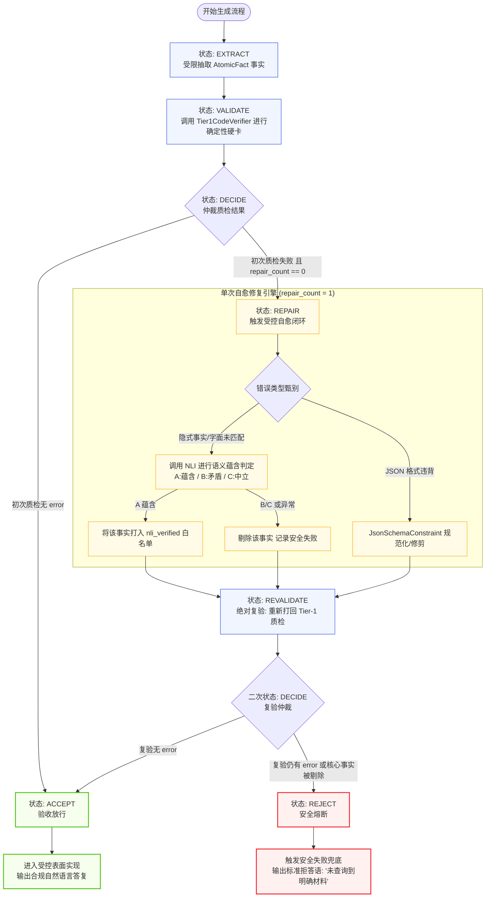
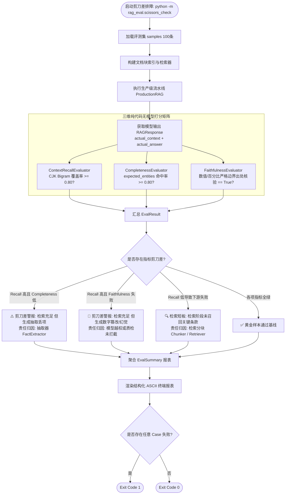
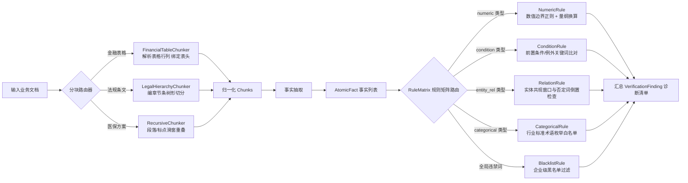

# Aegis-RAG（Python 版本）系统全景架构、业务总结与流程图

> **文档定位**：本文基于 `GamKing/Aegis-RAG` Python 版本的完整代码实现，系统性梳理当前项目的**全量业务场景、领域模型、架构拓扑与执行流程图**。旨在帮助新加入团队的工程师与技术管理人员，迅速建立对项目全貌的结构化认知。

---

## 目录

- [一、项目核心定位与价值](#一项目核心定位与价值)
- [二、当前项目业务场景深度总结](#二当前项目业务场景深度总结)
  - [2.1 业务场景一：医疗与医保政策合规业务](#21-业务场景一医疗与医保政策合规业务)
  - [2.2 业务场景二：金融财报与量化指标核验业务](#22-业务场景二金融财报与量化指标核验业务)
  - [2.3 业务场景三：法律法规与多层级条文审计业务](#23-业务场景三法律法规与多层级条文审计业务)
  - [2.4 支撑业务一：评测集自动化合成与对抗变异工程](#24-支撑业务一评测集自动化合成与对抗变异工程)
  - [2.5 支撑业务二：“指标剪刀差”排障与失败归因业务](#25-支撑业务二指标剪刀差排障与失败归因业务)
  - [2.6 支撑业务三：底层概率可解释性（Logprobs）测谎风控业务](#26-支撑业务三底层概率可解释性logprobs测谎风控业务)
- [三、系统核心流程图（Mermaid 体系）](#三系统核心流程图mermaid-体系)
  - [3.1 端到端系统架构全景流程图](#31-端到端系统架构全景流程图)
  - [3.2 生成端受限状态机（FSM）与自愈闭环流程图](#32-生成端受限状态机fsm与自愈闭环流程图)
  - [3.3 离线自动化评测与剪刀差排障流程图](#33-离线自动化评测与剪刀差排障流程图)
  - [3.4 垂直行业插件分流与规则矩阵路由流程图](#34-垂直行业插件分流与规则矩阵路由流程图)
- [四、核心代码模块与业务映射矩阵](#四核心代码模块与业务映射矩阵)
- [五、快速上手与业务验证指引](#五快速上手与业务验证指引)

---

## 一、项目核心定位与价值

**Aegis-RAG（Offline RAG Eval Harness）** 是一个面向**高安全、强严肃业务领域**（金融、医疗、法律、政务等）的**工业级可靠性 RAG 系统与自动化评测治理套件**。

### 核心解决的行业痛点：
1. **黑盒幻觉泛滥**：传统端到端 RAG 容易在数字、年份、比例、否定词、前置条件上“一本正经地胡说八道”，产生严重披露或合规事故；
2. **评测成本高昂且飘忽**：依赖在线大模型做裁判（LLM-as-a-Judge）不仅慢、贵，而且评分标准不稳定；
3. **责任归因不清**：线上回答出错时，无法自动化分辨究竟是检索没查全（Retrieval Failure），还是模型在生成润色时自行脑补（Generation Drift）。

### 核心破局思路：
- **事实用契约约束**：通过 `AtomicFact` 与 `ExtractionPayload` 实行强类型结构化输出；
- **边界用代码硬卡**：采用毫秒级纯代码 `Tier1CodeVerifier` 正则边界与规则矩阵，实行一票否决；
- **自愈由状态机驱动**：基于 `GenerationFSM` 实行单次打回重试与 NLI 语义复核，修复后强制绝对复验；
- **文采由受控实现**：通过 `EntityAwareRealizer` 纯规则零 LLM 回溯拼接，数学级杜绝二次脑补。

---

## 二、当前项目业务场景深度总结

当前项目并非虚构玩具，而是针对企业级真实痛点沉淀了 **3 个垂直业务场景 + 3 个底层治理支撑业务**：

```mermaid
mindmap
  root((Aegis-RAG 业务全景))
    垂直业务场景
      医疗与医保政策业务
        门诊与住院分级支付
        起付线与倾斜补偿
        除外责任与紧急处置
      金融与量化财报业务
        跨语言量纲换算 (million/billion -> 亿)
        GAAP 与 Non-GAAP 口径隔离
        财务表格结构化切块与比对
        前瞻性声明与未作假设 (Not assuming -> 0)
      法律法规与合规审计业务
        编-章-节-条-款多级层级树
        禁止性规范 (不得/禁止/除外) 否定检测
        行业黑名单术语硬拦截
    底层治理支撑业务
      评测集自动化生成与对抗变异工程
        100+ 工业 Golden Dataset
        数字篡改 / 条件丢失 / 伪造注入变异
      指标剪刀差排障与链路归因
        检索 Context Recall / Hit@K
        生成 Completeness / Faithfulness
        三高一低精准定界与定位
      底层概率测谎与可解释风控
        Token 级 Logprobs 概率透视
        关键实体最小置信度扫描
        全文困惑度 (PPL) 混乱检测
```

---

### 2.1 业务场景一：医疗与医保政策合规业务

- **业务背景**：医疗与医保报销涉及民生底线，政策中充斥着严密的数字梯次、人群分类及除外条款，一旦错答会引发信访或医疗事故。
- **代表性用例**：
  - `med-ins-001`（标准基线）：参保职工在一级医疗机构门诊支付比例 75%、二级 65%、三级 55%；
  - `med-ins-002`（检索缺失传导）：检索遗漏三级医院条款与封顶线，考察系统是否如实作答；
  - `med-ins-003`（生成遗漏）：检索完美包含退休人员倾斜补偿条款，但模型抽取遗漏，捕捉指标剪刀差；
  - `med-ins-004`（前置例外条件）：异地就医先期自付比例与急诊特殊例外条款，严防绝对化作答；
  - `med-ins-005`（对抗数字篡改）：报销比例 85% 被对抗模型篡改为 95%，考察忠实度硬卡拦截。
- **业务规则支撑**：
  - 高权重医疗实体词表（定点医疗机构、城乡居民、参保职工、门诊慢特病等）；
  - 核心指标词表（起付线、封顶线、自负比例、降低幅度等）。

---

### 2.2 业务场景二：金融财报与量化指标核验业务

- **业务背景**：上市公司财报披露（如 NVIDIA 季报）对财务口径有极苛刻的审计要求。常见错误包括混淆 GAAP/Non-GAAP、遗漏财年季度、换算单位出错。
- **代表性用例**：
  - `nvda_cases`（Case 01~10）：覆盖营收规模、毛利率（Gross Margin）、稀释每股收益（EPS）、数据中心业务增长率；
  - `nvda_structured_cases`（结构化抽取测试）：
    - **Case 03（隐式语义 Facts）**：原文提到“NVIDIA is not assuming any Data Center compute revenue from China”，模型抽取结果为 `China Compute Revenue = 0 USD`。系统通过 Tier-2 NLI 判定其为**蕴含（Entailment）**，成功自愈放行；
    - **Case 06（恶意数字篡改）**：指引数据 `7.2 billion` 被篡改为 `9.5 billion`，被 Verifier 识别并安全阻断；
    - **Case 07（无中生有事实拦截）**：财报中仅提及 Blackwell 芯片，未提及汽车业务收入，系统严禁模型自行脑补。
- **业务规则支撑**：
  - `FinancialTableChunker`：专门处理 Markdown / ASCII / CSV 财务报表，切块时自动绑定表头列名与行主键；
  - `UnitConversionRule`：将 `$108.0 billion` 自动折算为 `1080 亿`，将 `59,688 million` 自动对齐为 `596.88 亿`。

---

### 2.3 业务场景三：法律法规与多层级条文审计业务

- **业务背景**：法条、行政法规与行业合规条例具有强烈的树状层级结构，且禁止性词汇直接决定合法与否。
- **业务规则支撑**：
  - `LegalHierarchyChunker`：基于正则表达式识别“第 X 编 / 第 X 章 / 第 X 节 / 第 X 条”，切块时自动将父级章节标题拼接到当前 Chunk 首部，彻底解决子法条脱离上下文语境导致检索失真的问题；
  - `RelationRule` & `ConditionRule`：自动核查客体值周围是否存在“必须”、“应当”、“不得”、“严禁”等前缀；一旦发现否定词被模型倒置或剥除，立即触发一级安全拦截；
  - `BlacklistRule`：企业级敏感词与违禁概念硬拦截库。

---

### 2.4 支撑业务一：评测集自动化合成与对抗变异工程

- **业务背景**：严肃 RAG 系统绝不能仅靠人工手写 5~10 条样例进行评估。必须有流水线批量制造**正常样本、边界样本与恶意对抗样本**。
- **核心模块**：[`rag_eval/data_generator.py`](file:///D:/source/evalProject/rag_eval/data_generator.py)
- **业务能力**：
  - 支持固定随机种子生成 100+ 条全字段 Golden Dataset（已落地于 [`golden_dataset_100.json`](file:///D:/source/evalProject/golden_dataset_100.json)）；
  - **四大对抗变异算子（Mutations）**：
    1. `mutate_digit_swap`：随机篡改政策数字或年份；
    2. `mutate_drop_condition`：剔除前置条件与例外从句；
    3. `mutate_drop_entity`：丢弃关键主体实体；
    4. `mutate_inject_fabrication`：无中生有注入未经授权的事实主张。
  - 三大样本分类：合成标准类（`syn-`）、边界条件类（`edge-`）、对抗攻击类（`adv-`）。

---

### 2.5 支撑业务二：“指标剪刀差”排障与失败归因业务

- **业务背景**：当用户抱怨“回答不准”时，传统工程团队往往陷入盲目调优。剪刀差工具能够自动抓出责任方。
- **核心模块**：[`rag_eval/scissors_check.py`](file:///D:/source/evalProject/rag_eval/scissors_check.py)
- **指标矩阵与责任边界**：
  - **检索层指标**：
    - `ContextRecall`：标准上下文词项在检索结果中的覆盖率（默认 $\ge 0.80$）；
    - `Hit@K`：Top-K 检索块是否命中了标准答案所需的黄金片段。
  - **生成层指标**：
    - `Completeness`：采分点实体（`expected_entities`）子串命中率（默认 $\ge 0.80$）；
    - `Faithfulness`：答案中全部数值与百分比是否在上下文中均有出处（一票否决制）。
  - **指标剪刀差（Scissors）典型归因**：
    - 若 `ContextRecall >= 0.80` 但 `Completeness < 0.80`：**生成端抽取遗漏**（检索做到了，但模型偷懒丢了事实）；
    - 若 `ContextRecall >= 0.80` 但 `Faithfulness == False`：**生成端数字幻觉**（检索做到了，但模型胡编乱造）。

---

### 2.6 支撑业务三：底层概率可解释性（Logprobs）测谎与双链路风控架构

- **业务背景**：大语言模型在生成凭空编造的数据时，虽然表面文字语气斩钉截铁，但底层 Token 概率分布会剧烈跳水。
- **核心模块**：[`rag_eval/verifiers/logprobs_analyzer.py`](file:///D:/source/evalProject/rag_eval/verifiers/logprobs_analyzer.py)
- **底层机制碰撞（Logit Masking 致盲陷阱）**：
  - 在线上使用 FSM Logit Masking 强制锁定 JSON Schema 时，非法词 Logit 被强设为 $-\infty$；
  - Softmax 分母被抹除竞争者，导致原本心虚的 Token 概率被人工拉升至 $100\%$（$\text{Logprob} = 0.0$），造成**线上测谎仪彻底致盲**。
- **终局解耦架构规范**：
  - **【线上实时业务主链路】**：开启 FSM 前验硬约束（100% 锁死 JSON），**关闭线上 logprobs 请求**（省延迟与带宽）；由后验确定性质检（Tier-1 纯代码 Verifier）执行绝对一票否决（哪怕模型以 100% 置信度撒谎，无原文出处即拦截）；
  - **【线下/异步可观测性链路】**：在离线沙盒剥离 JSON 约束自由作答并开启 `logprobs=True`，用于大盘长周期跟踪全局 PPL 漂移与人机协作高亮核对。

---

## 三、系统核心流程图（Mermaid 体系）

### 3.1 端到端系统架构全景流程图

下图展示了从原始知识文档建库、用户提问、混合检索、两段式受控处理、中间质检，直到最终评测打分的端到端全景流：

```mermaid
flowchart TD
    subgraph Docs ["1. 离线文档处理与建库 (Offline Ingestion)"]
        RawDocs[企业原始文档/政策/财报] --> ChunkerChoice{文档类型分流}
        ChunkerChoice -->|通用文本| RecChunker[RecursiveChunker\n段落优先+句子滑窗]
        ChunkerChoice -->|财务报表| FinChunker[FinancialTableChunker\n表头与行列元数据绑定]
        ChunkerChoice -->|法律规章| LegChunker[LegalHierarchyChunker\n编章节条树状继承]
        RecChunker --> Chunks[切分块文本 Chunks]
        FinChunker --> Chunks
        LegChunker --> Chunks
        Chunks --> Index[构建索引: 词频索引 + 稠密向量]
    end

    subgraph Retrieval ["2. 实时混合检索阶段 (Hybrid Retrieval)"]
        UserQ([用户提问 User Query]) --> Hybrid[HybridRetriever 混合检索器]
        Index --> Hybrid
        Hybrid --> BM25[SimpleBM25\nCJK Bigram+词项检索]
        Hybrid --> Vec[VectorEngine\n语义稠密向量检索]
        BM25 --> RRF[RRF 倒数排名融合\nReciprocal Rank Fusion]
        Vec --> RRF
        RRF --> TopK[召回 Top-K 优质上下文 Context]
    end

    subgraph TwoStage ["3. 受控生成与质检阶段 (Controlled Pipeline)"]
        TopK --> Extractor[第一段: FactExtractor\n结构化原子事实抽取]
        UserQ --> Extractor
        Extractor --> RawPayload[ExtractionPayload\n(AtomicFacts JSON)]
        
        RawPayload --> FSM[GenerationFSM 状态机控制]
        FSM <--> Tier1[Tier-1 代码质检网关\n边界/量纲/实体/否定词]
        FSM <--> Tier2[Tier-2 NLI 语义仲裁 / 单次自愈]
        
        FSM -->|质检 100% 通过| PassFacts[已核验事实清单 Verified Facts]
        FSM -->|质检仍失败| FailSafe([安全熔断: 合规拒答])
        
        PassFacts --> Realizer[第二段: EntityAwareRealizer\n零 LLM 上下文回溯规则拼接]
        Realizer --> FinalAns([合规自然语言答复 Final Answer])
    end

    subgraph Evaluation ["4. 离线评测与质检闭环 (Evaluation Harness)"]
        FinalAns --> EvalRunner[EvalRunner 评测引擎]
        TopK --> EvalRunner
        EvalRunner --> C1[ContextRecallEvaluator]
        EvalRunner --> C2[CompletenessEvaluator]
        EvalRunner --> C3[FaithfulnessEvaluator]
        EvalRunner --> C4[HitAtKEvaluator]
        C1 --> Report[结构化 ASCII 报表 / 剪刀差分析]
        C2 --> Report
        C3 --> Report
        C4 --> Report
        Report --> CIPass{全部用例达标?}
        CIPass -->|是| Exit0([退出码 0 / CI 通过])
        CIPass -->|否| Exit1([退出码 1 / CI 拦截])
    end

    classDef stage1 fill:#e6f7ff,stroke:#1890ff,stroke-width:1px;
    classDef stage2 fill:#fffbe6,stroke:#faad14,stroke-width:1px;
    classDef stage3 fill:#f6ffed,stroke:#52c41a,stroke-width:1px;
    classDef stage4 fill:#fff0f6,stroke:#eb2f96,stroke-width:1px;

    class RecChunker,FinChunker,LegChunker,Chunks stage1;
    class Hybrid,BM25,Vec,RRF,TopK stage2;
    class Extractor,RawPayload,FSM,Tier1,Tier2,PassFacts,Realizer stage3;
    class EvalRunner,C1,C2,C3,C4,Report stage4;
```

---

### 3.2 生成端受限状态机（FSM）与自愈闭环流程图

展示 `GenerationFSM` 的内部状态转移、守卫条件与双轨自愈控制：



---

### 3.3 离线自动化评测与剪刀差排障流程图

展示评测套件如何运行 100 条数据集、计算三项指标，并自动归因“剪刀差”：



---

### 3.4 垂直行业插件分流与规则矩阵路由流程图

展示不同行业的切块器与质检规则矩阵的分发逻辑：



---

## 四、核心代码模块与业务映射矩阵

为了便于在源码中快速定位，下表整理了 Python 版本的核心代码文件、类名与对应业务职责：

| 模块文件 | 核心类 / 函数 | 对应的业务与技术职责 |
| :--- | :--- | :--- |
| [`rag_eval/models.py`](file:///D:/source/evalProject/rag_eval/models.py) | `AtomicFact`, `ExtractionPayload`, `VerificationFinding`, `PipelineTrace` | **强类型数据契约**：定义原子事实类型、抽取结果包、质检诊断明细与全链路审计追踪 |
| [`rag_eval/fsm.py`](file:///D:/source/evalProject/rag_eval/fsm.py) | `GenerationFSM`, `JsonSchemaConstraint`, `run_fsm_pipeline` | **有限状态机**：管控 6 大生成状态生命周期，实现受限解码与单次自愈闭环 |
| [`rag_eval/surface.py`](file:///D:/source/evalProject/rag_eval/surface.py) | `EntityAwareRealizer`, `build_constrained_realizer_prompt` | **受控表面实现**：零 LLM 纯规则上下文实体与指标回溯拼接，杜绝二次脑补 |
| [`rag_eval/verifiers/logprobs_analyzer.py`](file:///D:/source/evalProject/rag_eval/verifiers/logprobs_analyzer.py) | `LogprobsLieDetector`, `TokenLogprobItem` | **底层概率测谎仪**：Token 级对数概率扫描、关键实体置信度风控与困惑度 PPL 计算 |
| [`rag_eval/verification_rules.py`](file:///D:/source/evalProject/rag_eval/verification_rules.py) | `RuleMatrix`, `NumericRule`, `RelationRule`, `UnitConversionRule` | **确定性规则矩阵**：数值防穿透、量纲自动换算、否定词反转检测与实体共现 |
| [`rag_eval/retrieval/chunker.py`](file:///D:/source/evalProject/rag_eval/retrieval/chunker.py) | `FinancialTableChunker`, `LegalHierarchyChunker`, `RecursiveChunker` | **垂直行业切块器**：金融表格元数据绑定、法律多层级树状切块与自适应滑窗 |
| [`rag_eval/retrieval/hybrid_retriever.py`](file:///D:/source/evalProject/rag_eval/retrieval/hybrid_retriever.py) | `HybridRetriever`, `SimpleBM25` | **混合检索引擎**：CJK Bigram 分词、词项倒排、稠密向量检索与 RRF 融合 |
| [`rag_eval/data_generator.py`](file:///D:/source/evalProject/rag_eval/data_generator.py) | `generate_dataset`, `MUTATIONS` | **评测集自动化工程**：数字篡改、条件丢弃、实体丢失、伪造事实对抗变异 |
| [`rag_eval/evaluators.py`](file:///D:/source/evalProject/rag_eval/evaluators.py) | `ContextRecallEvaluator`, `CompletenessEvaluator`, `FaithfulnessEvaluator` | **三维纯代码评分器**：上下文召回率、关键实体完整性、数值真实性一票否决 |
| [`rag_eval/scissors_check.py`](file:///D:/source/evalProject/rag_eval/scissors_check.py) | `main` | **排障 CLI 工具**：在 100 条数据集上自动化捕获“三高一低”剪刀差并精准归因 |
| [`rag_eval/pipeline.py`](file:///D:/source/evalProject/rag_eval/pipeline.py) | `PipelineRAG`, `run_controlled_pipeline`, `Tier1CodeVerifier` | **受控生成流水线**：抽取、Tier-1 代码质检、Tier-2 NLI 兜底、复验与合成装配总线 |
| [`rag_eval/report.py`](file:///D:/source/evalProject/rag_eval/report.py) | `render_report` | **报表渲染引擎**：终端结构化 ASCII 彩色报表输出与指标剪刀差报警提示 |

---

## 五、快速上手与业务验证指引

在本地终端中，可以通过以下几组命令完整体验并验证上述全部业务：

### 1. 运行内置医保政策基准评测（观察 4 类典型失败模式）
```bash
python -m rag_eval
```
- 输出清晰展示 `med-ins-001` 全绿，`med-ins-002` 检索缺失，`med-ins-003` 剪刀差，`med-ins-004` 条件丢失，`med-ins-005` 数字篡改拦截。

### 2. 运行 100 条工业评测集与剪刀差自动排障
```bash
python -m rag_eval.scissors_check --n 100
```
- 自动完成递归建库、混合检索、受控生成、三项打分与指标剪刀差逐样本归因。

### 3. 执行全量单元测试与回归套件（112 项测试全部自动化验证）
```bash
python -m unittest discover -s tests -v
```
- 涵盖：FSM 状态机跳转守卫、Logprobs 测谎、金融表格切块、法律层级切块、NLI 语义仲裁自愈、规则矩阵路由等核心业务逻辑。

---
*(文档完)*
