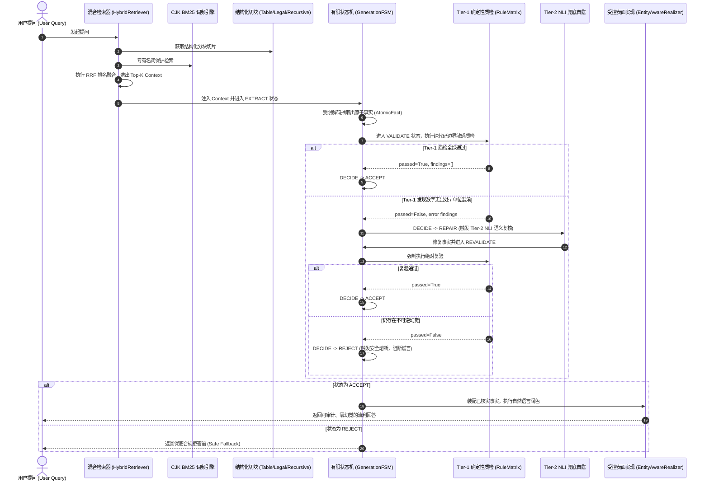

# Aegis-RAG 项目技术全景：核心解决问题与关键知识点深度剖析

> **项目名称**：Aegis-RAG 高可靠企业级检索增强生成系统  
> **核心哲学**：逆向工程、评测驱动开发（Evals-Driven Development, EDD）  
> **设计纲领**：用软件工程的确定性，约束大模型的随机性  
> **代码仓库**：[`GamKing/Aegis-RAG`](file:///D:/source/evalProject)

---

## 目录

- [一、项目背景与核心价值定位](#一项目背景与核心价值定位)
- [二、本项目解决了什么问题？（8 大痛点与突破）](#二本项目解决了什么问题8-大痛点与突破)
  - [1. 大模型“一本正经胡说八道”（致命数值篡改与幻觉）](#1-大模型一本正经胡说八道致命数值篡改与幻觉)
  - [2. “两个喝醉酒的人互证清白”（LLM-as-a-Judge 评测黑盒）](#2-两个喝醉酒的人互证清白llm-as-a-judge-评测黑盒)
  - [3. “指标剪刀差”排障盲区（检索达标，生成塌陷）](#3-指标剪刀差排障盲区检索达标生成塌陷)
  - [4. 例外条款与表格被腰斩（结构破坏性切块）](#4-例外条款与表格被腰斩结构破坏性切块)
  - [5. 专有名词漏搜与语义漂移（单路检索失真）](#5-专有名词漏搜与语义漂移单路检索失真)
  - [6. 盲目重试导致延迟雪崩与二次脑补（自愈死循环）](#6-盲目重试导致延迟雪崩与二次脑补自愈死循环)
  - [7. Logit Masking 导致 Logprobs 测谎仪彻底致盲（虚假 100% 置信度）](#7-logit-masking-导致-logprobs-测谎仪彻底致盲虚假-100-置信度)
  - [8. 输出纯 JSON 导致自然语言评测塌陷（表面实现矛盾）](#8-输出纯-json-导致自然语言评测塌陷表面实现矛盾)
- [三、本项目使用了哪些知识点？（6 大核心技术栈）](#三本项目使用了哪些知识点6-大核心技术栈)
  - [1. 信息检索与文档工程（Information Retrieval）](#1-信息检索与文档工程information-retrieval)
  - [2. 编译原理与受限解码（FSM & Constrained Decoding）](#2-编译原理与受限解码fsm--constrained-decoding)
  - [3. 确定性代码验证工程（Deterministic Verifier）](#3-确定性代码验证工程deterministic-verifier)
  - [4. 信息论与底层概率可解释性（Logprobs & Probability Theory）](#4-信息论与底层概率可解释性logprobs--probability-theory)
  - [5. 软件架构模式与工程化设计（Software Engineering）](#5-软件架构模式与工程化设计software-engineering)
- [四、项目端到端协同全景图](#四项目端到端协同全景图)
- [五、总结与工程哲学](#五总结与工程哲学)

---

## 一、项目背景与核心价值定位

在严肃、高合规的企业级生产环境（如医保政策结算、金融财报审计、法律规章检索）中，大模型生成的“不可预测性”是阻碍其商用落地的头号杀手。

传统 RAG 方案通常依赖复杂的提示词工程（Prompt Engineering）或大模型自评（LLM-as-a-Judge），但这本质上是“概率对抗概率”，不仅无法保证 100% 可审计，且面临严重的幻觉篡改、分块语义腰斩、延迟雪崩以及格式崩溃等问题。

**Aegis-RAG** 的核心定位是：**一套彻底剥离自由散文叙事权，由纯代码确定性规则守门、有限状态机驱动自愈、逆向评测集闭环验证的企业级高可靠 RAG 架构**。

---

## 二、本项目解决了什么问题？（8 大痛点与突破）

| 痛点分类 | 传统 RAG 的行业致命缺陷 | Aegis-RAG 的落地解决方案 | 核心映射模块 |
| :--- | :--- | :--- | :--- |
| **1. 致命数值幻觉** | 大模型常以笃定语气篡改数字、年份，或把“70%”说成“85%”，无法阻断。 | **Tier-1 纯代码确定性质检网关（Zero-Model）**：正则边界敏感防穿透、实体共现、单位硬隔离，无出处即一票否决。 | [`Tier1CodeVerifier`](file:///D:/source/evalProject/rag_eval/pipeline.py#L226)<br>[`RuleMatrix`](file:///D:/source/evalProject/rag_eval/verification_rules.py#L87) |
| **2. 评测黑盒陷阱** | 使用 LLM-as-a-Judge 打分，如同“两个喝醉酒的人互证清白”，打分不稳定、慢且昂贵。 | **三维纯代码度量衡体系**：CJK Bigram 覆盖度（Recall）、子串严格对齐（Completeness）与出处回溯（Faithfulness），100% 确定可审计。 | [`evaluators.py`](file:///D:/source/evalProject/rag_eval/evaluators.py)<br>[`runner.py`](file:///D:/source/evalProject/rag_eval/runner.py) |
| **3. 剪刀差排障盲区** | 检索召回很高（Recall 1.0），但答案完整性极低（Completeness 崩盘），定位极其困难。 | **剪刀差自动化排障引擎**：自动筛选剪刀差样本，输出精确到缺失字符片段、未命中实体与篡改数值的归因文本。 | [`scissors_check.py`](file:///D:/source/evalProject/rag_eval/scissors_check.py)<br>[`report.py`](file:///D:/source/evalProject/rag_eval/report.py) |
| **4. 结构性切块破损** | 按固定 Token 数硬切分，导致“直系亲属除外”等例外条款被腰斩，财务表格多级表头错位。 | **行业结构感知分块器**：① 段落双换行优先滑窗；② 法律编章节条树状继承；③ 财务报表按行转写为独立语义描述。 | [`chunker.py`](file:///D:/source/evalProject/rag_eval/retrieval/chunker.py) |
| **5. 专有名词检索失真** | 纯向量检索对冷门药名、法条编号不敏感；纯关键词检索缺乏语义泛化。 | **双路混合检索与 RRF 融合引擎**：纯 Python BM25（CJK Bigram + 专有名词保护）+ 向量检索插槽 + 倒数排名融合（RRF）。 | [`hybrid_retriever.py`](file:///D:/source/evalProject/rag_eval/retrieval/hybrid_retriever.py) |
| **6. 自由重试雪崩** | 校验失败后让大模型自由重写，越修越错，引入全新脑补，延迟成倍放大。 | **有限状态机（GenerationFSM）受控自愈闭环**：6 状态流转图，带错打回至 NLI，**修复后强制绝对复验（REVALIDATE）**，限重试 1 次，失败立即熔断。 | [`fsm.py`](file:///D:/source/evalProject/rag_eval/fsm.py) |
| **7. 测谎仪被致盲** | 线上使用 FSM Logit Masking 锁格式时，非法词 Logit 抹为 $-\infty$，Softmax 分母被拔除，导致心虚数字被人工拔高至 100% 置信度。 | **终局解耦架构（双链路物理隔离）**：线上实时链路关闭 `logprobs=True`，靠 Tier-1 确定性真正一票否决；线下自由沙盒开 Logprobs 监控全局 PPL 漂移。 | [`logprobs_analyzer.py`](file:///D:/source/evalProject/rag_eval/verifiers/logprobs_analyzer.py)<br>[`基于确定性Verifier的自愈闭环.md`](file:///D:/source/evalProject/基于确定性Verifier的自愈闭环.md#L420) |
| **8. 表面实现塌陷** | 受限抽取只输出纯 JSON/键值对，导致答案丢失句式动词，Completeness 实体评测挂掉。 | **受控表面实现装配器（Surface Realization）**：零温度抽取与自然语言润色彻底解耦，模板装配与实体回溯（`EntityAwareRealizer`）生成流畅合规人话。 | [`surface.py`](file:///D:/source/evalProject/rag_eval/surface.py)<br>[`ControlledSynthesizer`](file:///D:/source/evalProject/rag_eval/pipeline.py#L170) |

---

## 三、本项目使用了哪些知识点？（6 大核心技术栈）

```mermaid
mindmap
  root((Aegis-RAG 知识体系))
    信息检索与文档工程
      CJK Bigram 无词典分词
      BM25 概率相关度模型与专有名词保护
      RRF 倒数排名融合算法
      AST 树状层级分块 (LegalHierarchy)
      表格行语义转写 (FinancialTable)
      重叠滑窗 (Sliding Overlap Window)
    编译原理与受限解码
      有限状态机 (Deterministic FSM)
      状态守卫 (State Guards)
      运行时 JSON Schema 强制规范化
      Logit Masking 显存掩码机制
    确定性验证与模式匹配
      正则零宽断言 (Lookaround)
      Unicode NFC 规范化与全半角转换表
      跨语言日期解析与金融量纲硬隔离
      命题逻辑与否定词极性检测
      规则矩阵模式 (Rule Matrix)
    信息论与概率可解释性
      对数似然还原真实概率 P = exp(logprob)
      全文困惑度 (Perplexity, PPL) 量化
      Softmax 分母抹杀数学证明
      双链路解耦与协同裁决模式
    软件工程与设计模式
      Pydantic v2 强契约数据建模
      两段式解耦模式 (Extract-Synthesize)
      责任链与分层质检 (Tier-1 vs Tier-2)
      策略模式与可插拔行业插槽
      跨语言工程镜像 (Python + Java)
```

### 1. 信息检索与文档工程（Information Retrieval）

- **无词典分词（CJK Bigram Tokenization）**：
  零依赖外部第三方分词库（如 jieba），通过滑动字符窗口提取中文二元组（如“门诊报销” $\to$ `['门诊', '诊报', '报销']`），在低开销下稳健覆盖专有名词。
- **BM25 概率相关度模型**：
  自主实现纯 Python 版 BM25 词频/逆文档频率排序模型：
  $$\text{Score}(D, Q) = \sum_{i=1}^N \text{IDF}(q_i) \cdot \frac{f(q_i, D) \cdot (k_1 + 1)}{f(q_i, D) + k_1 \cdot \left(1 - b + b \cdot \frac{|D|}{\text{avgdl}}\right)}$$
  并引入专有名词保护机制（`tokenizer.protect()`），确保专有药名、合同编号不被切碎。
- **倒数排名融合（RRF, Reciprocal Rank Fusion）**：
  针对不同检索源（BM25 词面得分 vs 向量相似度得分）的得分量纲不一致问题，通过排名倒数加权动态融合两路打分：
  $$\text{RRF\_Score}(d \in D) = \sum_{m \in M} \frac{1}{k + r_m(d)} \quad (k=60)$$
- **结构感知分块（Structure-Aware Chunking）**：
  - **法律树状分块**：正则提取 `第[一二三...]条` 与章节标题，使子法条切片自动继承父章节标题元数据；
  - **财报行语义转写**：将 CSV/制表符表格切分成“`指标项为数值`”的独立断言语义单元。

### 2. 编译原理与受限解码（FSM & Constrained Decoding）

- **显式确定性有限状态机（Deterministic FSM）**：
  严格定义了 6 大状态（`EXTRACT` $\to$ `VALIDATE` $\to$ `DECIDE` $\to$ `REPAIR` $\to$ `REVALIDATE` $\to$ `ACCEPT` / `REJECT`），使用有向转移表（`_STATE_TRANSITIONS`）与转移守卫（State Guards）确保状态跳转 100% 可审计。
- **运行时 JSON Schema 强制规范化（Coercion & Pruning）**：
  在事实流出时执行顶层键白名单过滤、非法字段修剪、缺失默认值注入（`JsonSchemaConstraint`）。
- **受控自愈理论（Single-Retry Limit & Absolute Revalidation）**：
  - **铁律 1（单次重试）**：限制自愈闭环 `repair_count <= 1`，避免无限重试导致的死循环与延迟雪崩；
  - **铁律 2（绝对复验）**：NLI 修复出的结果必须重新经过同一套 Tier-1 规则矩阵扫描；
  - **铁律 3（安全失败）**：无法修复的数据一律进入 `REJECT`，输出保底安全应答。

### 3. 确定性代码验证工程（Deterministic Verifier）

- **正则零宽断言（Lookaround Assertion）**：
  使用 `(?<![\d.])value(?![\d.])` 边界敏感匹配，防止前缀与后缀串扰，严格杜绝 `1500` 误命中 `15000` 或 `31500`。
- **跨字符形态与单位归一化（Text & Unit Normalization）**：
  - **Unicode NFC 规范化** 与全角半角转换映射（`str.maketrans`）；
  - **千分位逗号抹除**（`1,500` $\to$ `1500`）；
  - **跨语言日期解析**（`September 15, 2026` / `2026-09-15` $\to$ `2026年9月15日`）；
  - **英文金融单位换算**（`million` / `billion` 自动对齐换算为中文“`亿`”）。
- **规则矩阵模式（Rule Matrix Pattern）**：
  建立多类型事实检验分发器（[`RuleMatrix`](file:///D:/source/evalProject/rag_eval/verification_rules.py#L87)），根据 `FactType`（数值、关系、条件、枚举）路由到专有子规则执行检验。

### 4. 信息论与底层概率可解释性（Logprobs & Probability Theory）

- **对数概率物理还原**：
  将大模型底层 API 输出的对数似然还原为真实百分比置信度：$P = \exp(\text{logprob})$。
- **全文困惑度（Perplexity, PPL）量化**：
  量化整段回答的语言平滑度与混乱程度：
  $$\text{PPL} = \exp\left( -\frac{1}{N} \sum_{i=1}^N \ln P(\text{Token}_i) \right)$$
- **分母抹杀理论（Denominator Truncation Proof）**：
  证明了 Logit Masking 介入 Softmax 之前强设非法 Logit 为 $-\infty$ 时，残存合法字符的分母被拔除，导致原生仅 0.03% 概率的 Token 被人工拉升至 100%（$\text{Logprob} = 0.0$）的工程致盲机制。
- **软预警与协同裁决模式**：
  测谎仪默认不拥有单独否决权（`allow_sole_veto=False`），仅在“低置信度 + 上下文无依据”双重确凿时协同否决，彻底解决高误杀（False Rejection）问题。

### 5. 软件架构模式与工程化设计（Software Engineering）

- **两段式解耦模式（Extract-Synthesize Decoupling）**：
  - **第一段（抽取期）**：剥夺散文叙事权，以零温度（Temperature=0.0）强制输出结构化原子事实元组（Subject, Predicate, Object, Polarity）；
  - **第二段（合成期）**：大模型仅充当“打字员/表面实现润色器”，只能消费已通过质检的事实白名单，严禁添加任何新事实。
- **Pydantic v2 强契约数据建模**：
  构建跨模块传输的强数据契约（[`EvalSample`](file:///D:/source/evalProject/rag_eval/models.py#L40), [`AtomicFact`](file:///D:/source/evalProject/rag_eval/models.py#L24), [`ExtractionPayload`](file:///D:/source/evalProject/rag_eval/models.py#L65), [`VerificationFinding`](file:///D:/source/evalProject/rag_eval/models.py#L73), [`PipelineTrace`](file:///D:/source/evalProject/rag_eval/models.py#L90)）。
- **行业插槽设计（Plugin Slot Architecture）**：
  - **插槽 1（分块插槽）**：`BaseChunker` 支持通用、法律、金融自定义分块；
  - **插槽 2（词表插槽）**：`SimpleBM25` 支持注入医学、行业专有词库；
  - **插槽 3（规则插槽）**：`RuleMatrix` 支持注册行业禁忌黑名单与特定量纲规则。
- **双语工程落地与质量保障**：
  - Python 原生库 + 115 个单元测试（覆盖率高，运行耗时仅 0.07s）；
  - Java 8/17 企业级跨语言镜像（[`java-rag-eval/`](file:///D:/source/evalProject/java-rag-eval)），便于大厂生产级基础设施集成。

---

## 四、项目端到端协同全景图

下图完整展示了一次端到端请求中，检索组件、状态机、代码质检网关与表面实现器的流转协同：



---

## 五、总结与工程哲学

Aegis-RAG 的技术价值可以凝练为一句话：

> **“将过去交给大模型自由发挥的黑盒流程（抽取、查验、判定、重试、修饰），彻底拆解为由有限状态机驱动、由纯代码确定性规则守门、由逆向评测集量化监控的可复现工业级工程流水线。”**
